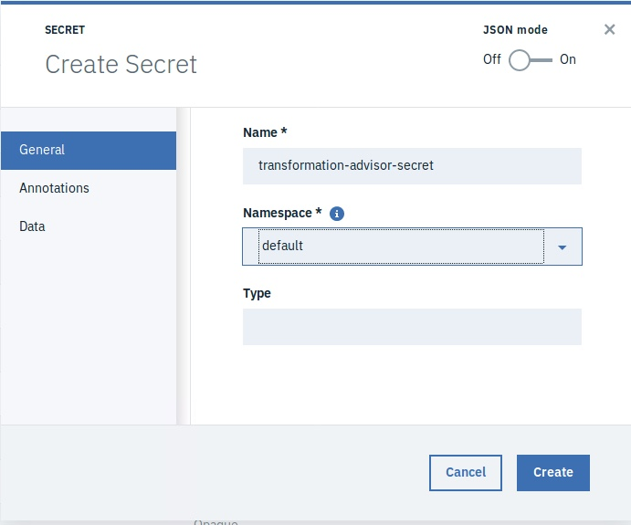
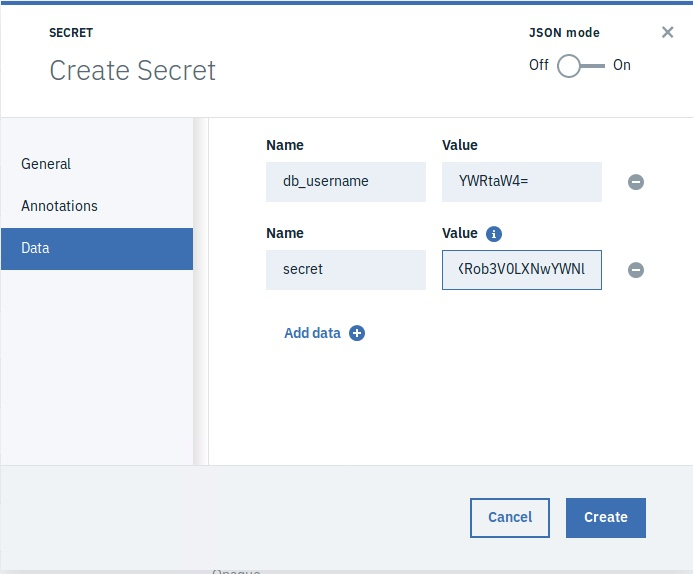
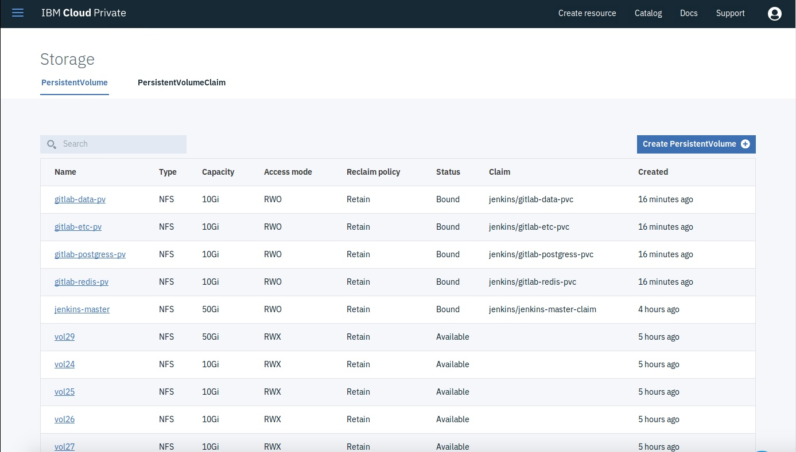
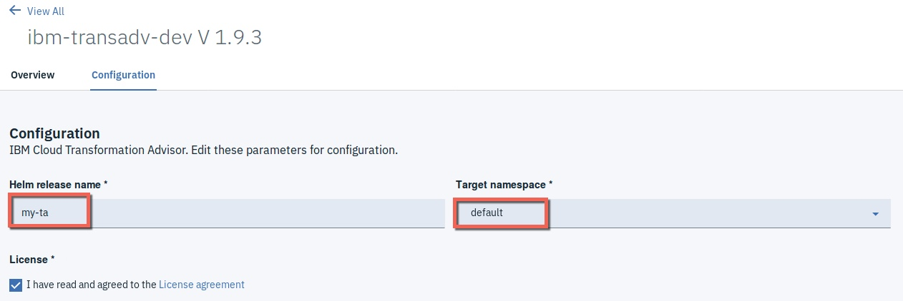
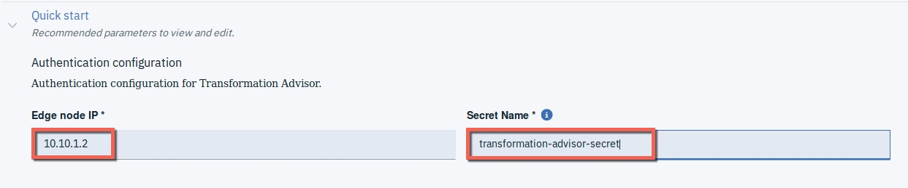
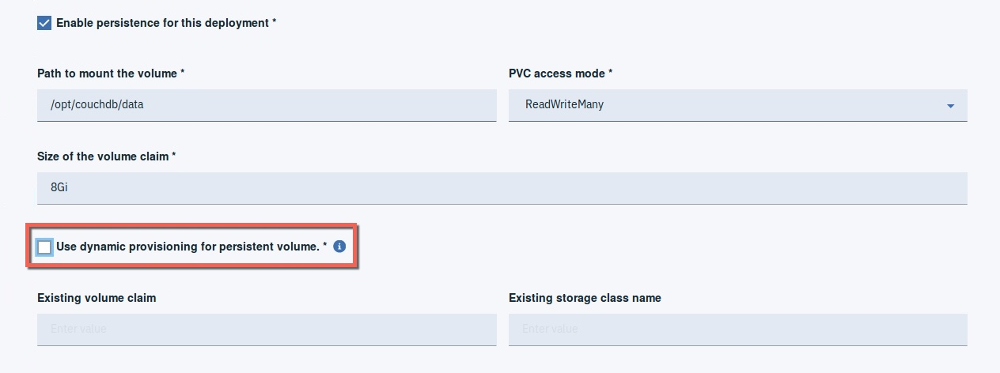
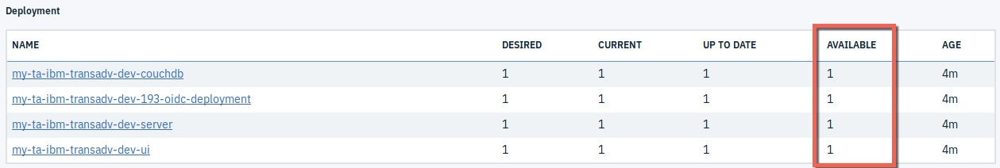
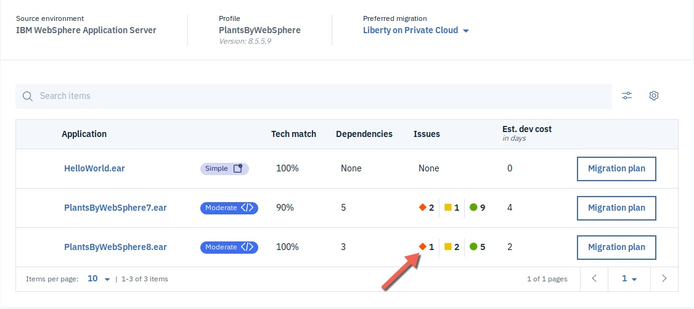
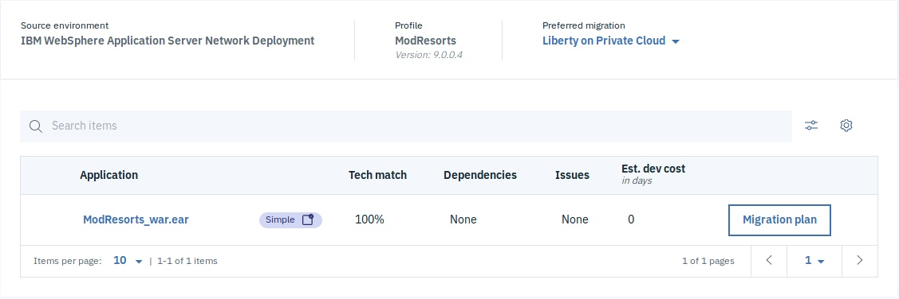
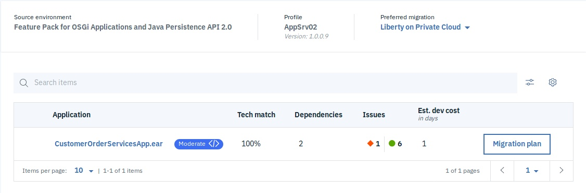

# Install Transformation Advisor  


## 1. Install Transformation Advisor on ICP

Transformation Advisor is installed on ICP from ICP Catalog via a helm chart and is typically installed in to the `default` namespace.

Versions of Transformation Advisor prior to v1.9 were *only* installable into ICP default namespace. As of v1.9, TA can be installed into a non-default namespace, refer to chart's README for further details how to install into non-default namespace.


### Pre-requisites to install TA:
1. Create a secret for Couch DB to be used during TA install. For this demo environment you can use default secret values suggested by the TA chart readme:

```bash
echo -n 'admin' | base64
# output: YWRtaW4=

echo -n "this-will-be-my-secret-without-space" | base64
# output: dGhpcy13aWxsLWJlLW15LXNlY3JldC13aXRob3V0LXNwYWNl
# Please you user own secret value
```

Once you have the base64 encrypted values, use the ICP UI to create a new secret usign the following values:

  Name: `transformation-advisor-secret`

  Namespace: `default`

  db_username: `YWRtaW4=`

  secret: `dGhpcy13aWxsLWJlLW15LXNlY3JldC13aXRob3V0LXNwYWNl`

  
</p>



2. Make sure there is suitable Persistent volume (PV) available to be used by TA.
This step is NOT required if your ICP cluster supports dynamic provisioning of persistent volumes, as in this case PV will be automatically provisioned.
If your cluster only supports static persistent volumes, follow the instructions below.

Examine PVs available in your cluster, e.g.



Note that PVs Access mode of available PVs is RWO ("ReadWriteOnce").

3. Install TA helm chart    

Installation steps:  

3.1. Locate ibm-transadv-dev chart in ICP Catalog, review README and click Configure.

Provide helm release name and select `default` target namespace:
  

3.2. Provide master node IP (`10.10.1.2`) and correct secret name in Quick Start section:
  

3.3. Configure persistence options:
  

3.4. Leave all other chart settings defaults. Click Install. Examine deployed chart release, wait until all TA pods have successfully started:


3.5. Locate TA launch link now added to ICP menu (reload the console UI if needed)   


You should see the TA UI.  The TA is successfully installed.

## 2. Examine some sample scan results

### Engagement Mockup #1: PlantsByWebSphere

Create a "Lab" workspace and a "PlantsByWebSphere" data collection in TA and upload DataCollector results for PlantsByWebSphere app:
https://github.com/ibm-cloud-architecture/icp-dev-workshop/blob/master/lab3/PlantsByWebSphere.zip

Examine the TA Report for PlantsByWebSphere7 and PlantsByWebSphere8. Review the Analysis, Inventory and Technology reports.

NOTE:  The TA analysis of PlantsByWebSphere8 shows 1 severe level issue (below).  This is a an example of a “false positive”. Why is it a false positive? This issue does not affect the no code changes required for migration.



### Engagement Mockup #2: ModResorts
Upload the DataCollector scan results for another simple app - Mod Resorts. Create a new "ModResorts" data collection in the existing "Lab" workspace and upload the zip file:
https://github.com/ibm-cloud-architecture/icp-dev-workshop/blob/master/lab3/ModResorts.zip

Examine the TA Report for ModResorts_war.ear. Download the "bundle of files" from the migration plan and examine the automatically generated files.




### Engagement Mockup #3: Customer Order
Upload the DataCollector scan results for another application - CustomerOrder. Create a new "CustomerOrder" data collection in the existing "Lab" workspace and upload the zip file:
https://github.com/ibm-cloud-architecture/icp-dev-workshop/blob/master/lab3/AppSrv02.zip

Examine the TA Report for CustomerOrderServicesApp.ear. Which file has been highlighted by TA as needing to have the EJB Bindings changed?


