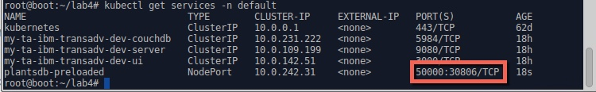
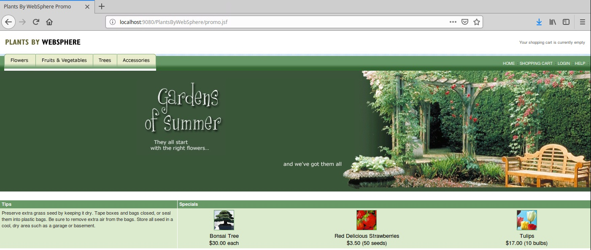
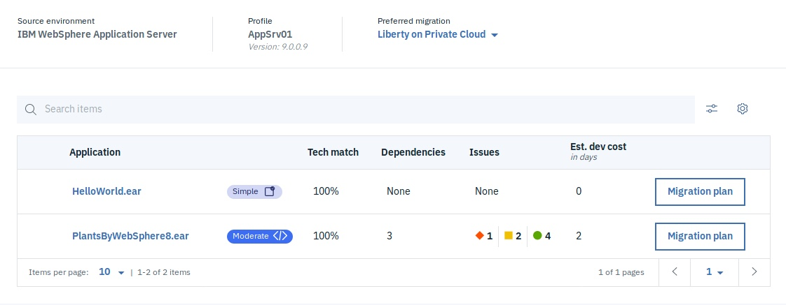
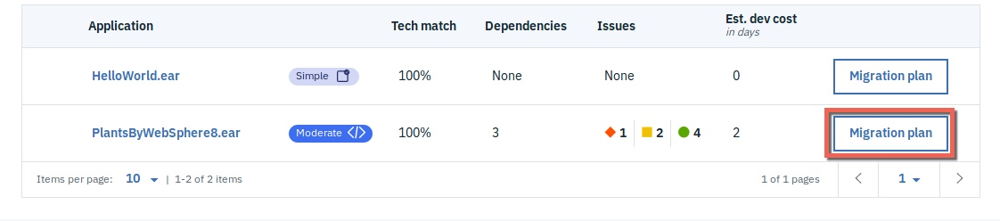
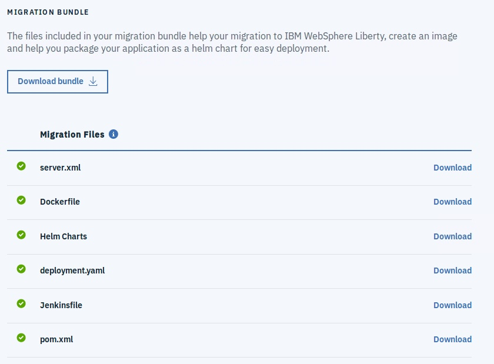
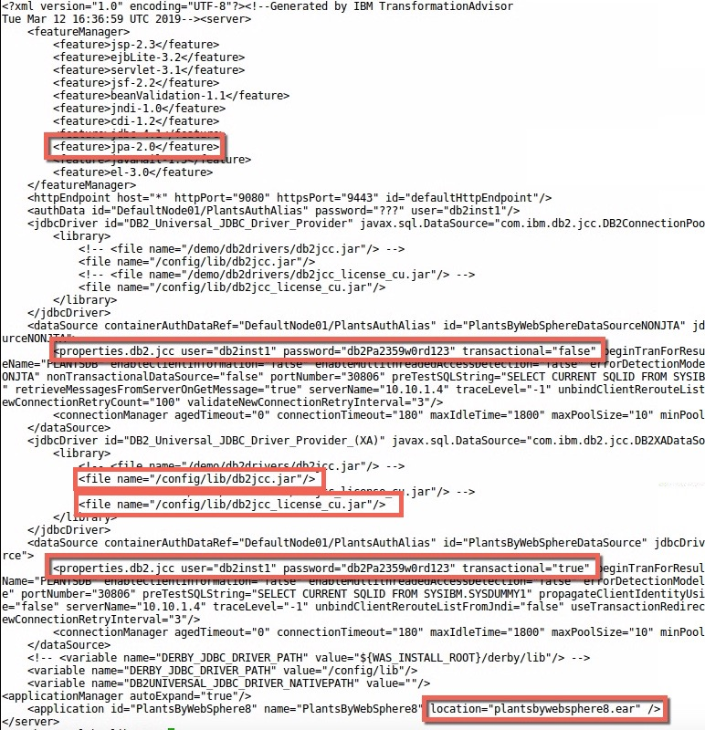
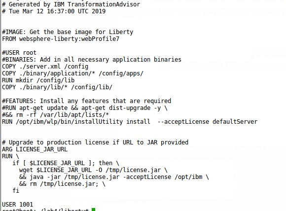
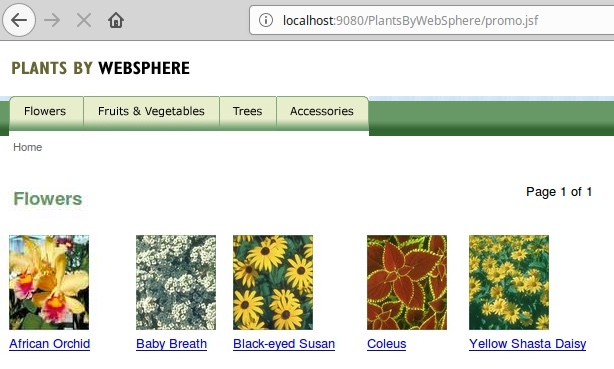
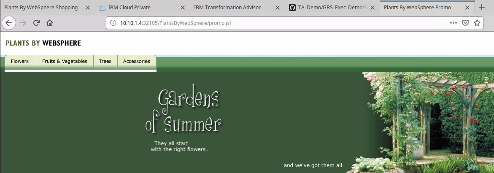

# Modernize Simple App (no code changes required)

The goal of this part of mock engagement is to modernize the PlantsByWebSphere application running on traditional WAS to run on IBM Cloud Private.  

**Note:** Tasks 1-3 below are performed locally, step 4 required ICP access

## Task 1: Setup Application Environment
PlantsByWebSphere required traditional WAS (tWAS) and DB2 instance to run. In this excercise both tWAS and DB2 environments will be simulated by running corresponding Docker containers.  

### Setup pre-loaded DB2 image with pre-configured application database

The instructions below will deploy a pre-configured application DB2 database in a container on ICP.

1. Download pre-loaded DB2 image with pre-configured application database.  

```bash
docker pull vandepol/plantsdb-preloaded
```

This image contains a pre-configured DB2 database. The credentials for DB2 are:

``` bash
DB2 User:  db2inst1   
DB2 Password: db2Pa2359w0rd123
```

2. Tag and Push the DB2 Docker image to the ICP Docker Registry

```bash
docker tag vandepol/plantsdb-preloaded mycluster.icp:8500/default/plantsdb-preloaded

docker login -u admin -p admin mycluster.icp:8500

docker push mycluster.icp:8500/default/plantsdb-preloaded
```

3. Deploy DB2 container into ICP

To deploy a container into ICP we need Kubernetes resource definitions for a deployment and a service.

Create a `/root/lab4` folder

Create a file named `deploy.yaml` in `/root/lab4` with the following contents:

```bash
apiVersion: v1
kind: Service
metadata:
  name: "plantsdb-preloaded"
  namespace: "default"
spec:
  type: NodePort
  ports:
  - name: db2
    port: 50000
    protocol: "TCP"
    targetPort: 50000
  selector:
    app: "plantsdb-preloaded"
---
apiVersion: extensions/v1beta1
kind: Deployment
metadata:
  name: "plantsdb-preloaded"
  namespace: "default"
spec:
  replicas: 1
  template:
    metadata:
      labels:
        app: "plantsdb-preloaded"
    spec:
      containers:
      - name: plantsdb-preloaded-db2express-c
        image: mycluster.icp:8500/default/plantsdb-preloaded
        args: ["db2start"]
        env:
        - name: LICENSE
          value: "accept"
        - name: DB2INST1_PASSWORD
          value: "db2Pa2359w0rd123"
```

4. Run the following command to create the deployment and service

```bash
kubectl create -f deploy.yaml
```

5. Run the following command to get the NodePort that has been assigned to the service

```bash
kubectl get services -n default
```



In our case DB2 endpoint will be `10.10.1.4:30806`

### Traditional WAS setup
In this section you will build tWAS image with Plants By WebSphere application and Transformation Advisor data collector pre-installed.
The tWAS application container will be run locally on Docker and will be used to run Transformation Advisor data collectors and collect scan results. The tWAS application container will be configured to use  preloaded DB2 container
Follow instructions to build tWAS image:

1. Clone XXX to your local disk:
```bash
cd /root/lab4
git clone https://github.com/ibm-cloud-architecture/icp-dev-workshop.git
```

2. Update `wsadmin.py` to reflect the `ip address` and `port` of your DB2 instance (from above). There are two DataSources, be sure that you update both

```bash
cd CreatePreConfiguredWASContainer
vi wsadmin.py
```

3. Build the Docker image:
```bash
docker build -t twas-plantsbywebsphere .
```

4. Start docker image to show running in tWAS.
```bash
docker run -p 9080:9080 -p 9443:9443 -p 9060:9060 -p 9043:9043 -v "$(pwd)":/data --name twas-plantsbywebsphere twas-plantsbywebsphere:latest
```

5. Login to admin console   
https://localhost:9043/ibm/console  
username: ```wsadmin``` password: ```passw0rd```

6. You should see helloWorld in  
http://localhost:9080/HelloWorld

7. You should see PlantsByWebSphere in http://localhost:9080/PlantsByWebSphere




## Task 2: Run Transformation Advisor

### Run TA data collector
Run the TransformationAdvisor data collector (which already has been added to tWAS docker image via instructions in Dockerfile).

1. Open a new terminal session and execute the following comamnd

```bash
docker exec -it twas-plantsbywebsphere /demo/transformationadvisor-2.1/bin/transformationadvisor -w /opt/IBM/WebSphere/AppServer -p AppSrv01 wsadmin passw0rd -no-version-check
```
This may take ~10 or more minutes to complete and will end with an error which is expected as at the end of the scan the DataCollector attempts to upload the results to a TA instance that no longer exists.

2. Copy resulting ZIP file to local machine using the following command

```bash
docker cp twas-plantsbywebsphere:/demo/transformationadvisor-2.1/AppSrv01.zip .
```

3. Enter `CTRL+C` in the terminal window where the traditional WebSphere container is running to shut the server down.

### Run TA Analysis
1. Create a new workspace `Lab4` and DataColletion `PlantsByWebSphere` in the Transformation Advisor running on your ICP instance.

2. Upload the `AppSrv01.zip` file that you created in the previous step.



3. Review Analysis, Technology and Inventory reports.
The analysis review confirms that PlantsByWebsphere8 is `SIMPLE` application for Modernization purposes.


##  Task 3: Modernize Application

### Migrate application to Liberty in Docker
Transformation Advisor creates many accelerators to speed up the process of migrating an application. You can see the accelerators created by Transformation Advisor. Click the Migration Plan button.





  * ```server.xml``` - The Transformation Advisor extracts most of the configuration from tWAS and generates a server.xml for Liberty to use.
  * ```Dockerfile``` - Used to create the docker image which includes the application, and configuration for Liberty.
  * ```Helm Charts``` - Used in IBM Cloud Private to simplify the deployment of the application.
  * ```deployment.yaml``` - Used to create a Kubernetes Deployment and Service in IBM cloud private (similar to Helm chart, used for development and devOps).
  * ```Jenkinsfile``` - Used to automate build in Jenkins to get started with devOps and CI/CD (Continuous Integration/Continuous Development).
  * ```pom.xml``` - Used for maven builds, particularly useful if the application does not already employ build scripts.

1. Download `server.xml` and `Dockerfile` and place them in `/root/lab4/liberty`

2. Copy `plantsbywebspherev8.ear` from `root/lab4/lab4/binary/application` and place it in `/root/lab4/liberty/binary/application`

3. Download `db2jcc.jar` and `db2jcc_licence_cu.jar` from
`root/lab4/lab4/binary/lib` and place them in `/root/lab4/liberty/binary/lib`

4. Issuing `ls -laR` in the `/root/lab4/liberty` folder should now return

  

5. Examine generated Liberty configuration file `/root/lab4/liberty/server.xml` and make the following changes:

  * change the `jpa-2.1` feature to `jpa-2.0`

  * change the DB2 driver location file names to be `/config/lib/db2jcc.jar` and `/config/lib/db2jcc_licence_cu.jar` for the `DB2 UNIVERSAL JDBC DRIVER PROVIDER` and the `DB2 UNIVERSAL JDBC DRIVER PROVIDER (XA)` jdbcDrivers. (THERE ARE TWO SETS OF FILE NAMES THAT MUST BE CHANGED)

  * add `user="db2inst1" password="db2Pa2359w0rd123" transactional="false"` to the `properties.db2.jcc` line of the `PlantsByWebSphereDataSourceNONJTA` datasource

  * add `user="db2inst1" password="db2Pa2359w0rd123" transactional="true"` to the `properties.db2.jcc` line of the `PlantsByWebSphereDataSource` datasource

  * add `location="plantsbywebsphere8.ear"` to the `application` line

  The modified `server.xml` should look like the one shown below:
  

6. Modify the generated Dockerfile `/root/lab4/liberty/Dockerfile` and make the following changes:

  * comment out the `USER root` line by adding a `#` to the beginning of the line

  * change the `COPY Dockerfile ./binary/application/* /config/apps/` line to read `COPY ./binary/application/* /config/apps/`

  * add two lines below `COPY ./binary/application/* /config/apps/` that read:
```bash
RUN mkdir /config/lib
COPY ./binary/lib/* /config/lib/
```

  * comment out the line starting with `RUN apt-get update` and the line that starts `$$ rm -rf` below it

  The modified `Dockerfile` should look like the one shown below:
  


7. Build the image using the following command

```
docker build -t plantsbyliberty .
```

8. Run an instance of the new container using the following command:

```
docker run -d -p 9080:9080 -p 9443:9443 --name plantsbyliberty plantsbyliberty
```

9. Open browser to http://localhost:9080/PlantsByWebSphere and confirm the app working as expected with the DB2 data by clicking the `Flowers` link.



10. Stop and remove the Docker container using the following commands:

```bash
docker stop plantsbyliberty
docker rm plantsbyliberty
```

##  Task 4: Deploy Modernized Application to ICP
You are now ready to deploy the modernized application to IBM Cloud Private. Use the instructions in Task 1 as reference.

1. Tag the `plantsbyliberty` Docker Image as `mycluster.icp:8500/default/plantsbyliberty`

2. Push the Docker Image to the ICP Docker registry

3. Use the yaml shown below to create a deployment and service.

```bash
apiVersion: v1
kind: Service
metadata:
  name: "plantsbyliberty"
  namespace: "default"
spec:
  type: NodePort
  ports:
  - name: http
    port: 9080
    protocol: "TCP"
    targetPort: 9080
  selector:
    app: "plantsbyliberty"
---
apiVersion: extensions/v1beta1
kind: Deployment
metadata:
  name: "plantsbyliberty"
  namespace: "default"
spec:
  replicas: 1
  template:
    metadata:
      labels:
        app: "plantsbyliberty"
    spec:
      containers:
      - name: plantsbyliberty
        image: mycluster.icp:8500/default/plantsbyliberty
```

4. Determine the NodePort being used by the new service

5. Open a browser and navigate to `http://10.10.1.4:<nodeport>/PlantsByWebSphere` and validate that the application is functioning

Congratulations, you have successfully deployed the PlantsByWebSphere application running on a Liberty application server in a container running on IBM Cloud Private!


