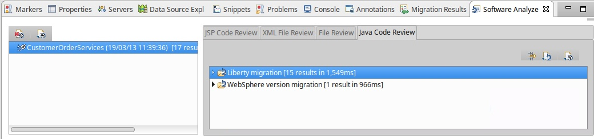

# Modernize Moderate App (come code changes required)

The goal of this part of mock engagement is to modernize the Customer Order (a.k.a. "Purple Compute") application running on traditional WAS to run on IBM Cloud Private.

Customer Order is a MODERATE complexity app for modernization purposes, as source code changes required (even thought very minimal).
Customer Order uses DB2 backend and LDAP for user authentication.

## Task 1. Setup pre-loaded DB2 image with pre-configured application database

#### Create Pre-loaded DB2 instance

Create a lab folder
```bash
mkdir /root/lab5
cd /root/lab5
```

Download base DB2 container image:
```bash
docker pull ibmcom/db2express-c:latest
```

Start the DB2 container:
```bash
docker run -d -e LICENSE=accept -e DB2INST1_PASSWORD=passw0rd -p 50000:50000 --name purple-compute-db-preloaded ibmcom/db2express-c:latest db2start
```

Open a shell into DB2 container:
```bash
docker exec -it purple-compute-db-preloaded  bash
```

Switch to db2 user defined in the base image
```bash
su - db2inst1
```
(login using passw0rd)

Create application database (this may take a few seconds to complete):

```bash
 db2 create DB ORDERDB
 DB20000I  The CREATE DATABASE command completed successfully.
```

Populate the database. Use pre-built script to pull all the needed ddl and sql files from git repo
https://github.com/ibm-cloud-architecture/refarch-jee-customerorder/tree/liberty/Common

```bash
 su - ${DB2INSTANCE} -c "bash <(curl -s https://raw.githubusercontent.com/ibm-cloud-architecture/refarch-jee-customerorder/liberty/Common/bootstrapCurlDb2.sh)"
```

Observe progress ending with
```bash
Database 'ORDERDB' bootstrapped for application use.
```

You can now exit from the db2inst1 session and then from the container shell
```bash
exit
exit
```

Commit the image, as it now has the data we want on it.
```bash
 docker commit purple-compute-db-preloaded mycluster.icp:8500/default/purple-compute-db-preloaded:latest
```

Stop the docker container and delete it.
```bash
 docker stop purple-compute-db-preloaded
 docker rm purple-compute-db-preloaded
```

#### Push pre-loaded DB2 instance to ICP
Now we can push the pre-loaded DB2 image to ICP:
```bash
 docker push  mycluster.icp:8500/default/purple-compute-db-preloaded
```

#### Create and run pre-loaded DB2 container on ICP
Create a file named `deploy.yaml` in `/root/lab5` with the following contents:

```bash
apiVersion: v1
kind: Service
metadata:
  name: "purple-compute-db-preloaded"
  namespace: "default"
spec:
  type: NodePort
  ports:
  - name: db2
    port: 50000
    protocol: "TCP"
    targetPort: 50000
  selector:
    app: "purple-compute-db-preloaded"
---
apiVersion: extensions/v1beta1
kind: Deployment
metadata:
  name: "purple-compute-db-preloaded"
  namespace: "default"
spec:
  replicas: 1
  template:
    metadata:
      labels:
        app: "purple-compute-db-preloaded"
    spec:
      containers:
      - name: purple-compute-db-preloaded
        image: mycluster.icp:8500/default/purple-compute-db-preloaded
        args: ["db2start"]
        env:
        - name: LICENSE
          value: "accept"
        - name: DB2INST1_PASSWORD
          value: "passw0rd"
```

4. Run the following command to create the deployment and service

```bash
kubectl create -f deploy.yaml
```

5. Run the following command to get the NodePort that has been assigned to the service

```bash
kubectl get services -n default
```


In our case DB2 endpoint will be `10.10.1.4:32518`

## Task 2: Analyze the application by using Transformation Advisor

1. Create a new `Lab5` workspace and a `PurpleCompute` collection in Transformation Advisor. Upload the provided results ZIP file for Customer Order from: https://github.com/ibm-cloud-architecture/icp-dev-workshop/blob/master/lab5/Lab5.zip


2. Click on the `CustomerOrderServicesApp.ear` and review the detailed results. Review the `severe` results and use the `Analysis` report to locate the files you'll need to change.

## Task 3: Download the application code and import it into Eclipse

1. In the `/root/lab5` folder enter the following command to download the application source code:
```bash
git clone https://github.com/ibm-cloud-architecture/refarch-jee-customerorder.git
```

2. Checkout the source code:
```bash
cd refarch-jee-customerorder
git checkout was70-dev
```

3. Open eclipse and accept the default workspace
```bash
cd /opt/eclipse
./eclipse
```

4. Import the existing projects by:
 * clicking `File > Import`.
 * In the `General folder`, click `Existing Projects into Workspace`.
 * Click `Next`.
 * In the `Select root directory field`, type `/root/lab5/refarch-jee-customerorder` and click `Browse`.
 * Click `Finish`

  

  * In the Workspace Migration window, click `Cancel`. In the migration cancel window, click `OK`.

## Task 4: Clean up the development environment

When you create a development environment, you might need to fix installation paths and development tool versions that differ from the original development environment. When you imported the project to Eclipse, any errors were highlighted with red error marks.


1. To view the problems in your workspace, click `Window > Show View > Other > General > Problems`. Click `OK`.

  Errors are shown for each of the projects that are related to the build path. In the projects for the new development environment, you need to update the references to the Java and WebSphere libraries.

2. Right-click a project and click Properties. In the properties window, click Java Build Path and then click Libraries.

  Note: You do not need to complete this step for the CustomerOrderServicesApp project.

  

3. Fix the paths for the two unbound libraries, which are the JRE System Library and the Server Library. As you can see, both libraries are pointing to the WebSphere Application Server traditional V7.0 libraries from the original development environment. To update those libraries to point to the appropriate path in your environment, follow these steps:

  a. Select the `JRE System library` and click Edit.
  b. Click `Workspace default JRE` and click Finish.

  

  c. Select the `Server library` and click Edit.
  d. Select `WebSphere Liberty` and click Finish.
  e. Click `Apply and Close` to close the properties window.

4. Repeat steps 2 - 3 for all the projects.

5. Fix the targeted runtime for the application using these steps:

  a. Right-click on `CustomerOrderServicesApp` and click Properties. b. In the Properties window, click `Targeted Runtimes`
  c. De-select `WebSphere Application Server traditional V7.0`
  d. Select `Liberty Runtime`
  e. Click `Apply and Close`

  

6. After you update the target runtime and the references to the Server and JRE System libraries, clean and rebuild the entire workspace by clicking `Project > Clean`. Make sure that Clean all projects is selected and click `OK`.

6. Look at the Problems view again:

  

7. You resolved several problems, but a few problems still exist. In this case, you want to fix the Xpath is invalid error. To fix that error:
  a. Right-click the `CustomerOrderServicesWeb` project and click `Properties`.
  b. In the properties window, click `Validation`
  c. Scroll to the `XSL Validator` and clear the `Manual` and `Build` options.
  d. Click `Apply and Close`.

  

8. Clean and rebuild the entire workspace

9. Look at the Problems view again:

  

10. Java build errors are caused by missing Jackson jars.  Locate and download missing jars:
  a. jackson-core-asl-1.9.13.jar (https://mvnrepository.com/artifact/org.codehaus.jackson/jackson-core-asl/1.9.13)
  b. jackson-jaxrs-1.9.13.jar (https://mvnrepository.com/artifact/org.codehaus.jackson/jackson-jaxrs/1.9.13)
  c. jackson-mapper-asl-1.9.13.jar (https://mvnrepository.com/artifact/org.codehaus.jackson/jackson-mapper-asl/1.9.13)
  d. Import Jackson jars into EAR/lib directory:

  

11. Java build errors are also in the CustomerOrderServiceTest project due to missing Apache Wink dependency.  
  a. Download the Apache Wink 1.4 zip file from http://archive.apache.org/dist/wink/1.4.0/
  b. unzip the zip file
  c. import wink-1.4.jar from apache-wink-1.4/dist into CustomerOrderServiceTest/WebContent/WEB-INF/lib

  

12. Now the projects have built without problems.

## Task 5: Configure the Software Analyzer
In this task, you configure the Software Analyzer that is part of the WebSphere Application Server Migration Toolkit.

1. In your Eclipse environment, click Run > Analysis. The Software Analyzer opens.

2. Right-click Software Analyzer and select New. Type a name for the new configuration and click the Rules tab for the configuration.

3. From the Rule Set menu, select WebSphere Application Server Version Migration and click Set. The "Rule set configuration" window opens.

  

4. Configure the settings so that the appropriate rules, based on your migration requirements, are applied when your applications are analyzed.

  

5. When you're finished, click OK.

## Task 6: Run the Software Analyzer
1. Click Analyze. After you run the Software Analyzer, the Software Analyzer Results tab is shown. The Software Analyzer rules and any errors and warnings are sorted in four categories: Java Code Review, XML File Review, JSP Code Review and File Review. Review each of the categories to determine whether code or configuration changes might be needed.

  

2. Click the File Review tab. The tab is empty

3. Click the Java Code Review tab. Warnings are shown for these aspects the WebSphere Application Migration Toolkit:

  

  Let's start with the warning about the default initalContext JNDI properties. View the information about the rule that flagged each error or warning by clicking Help > Show Contextual Help.

  To understand more about the problem, click it and read the Help information.

  Tip: If you need more information, click the detailed help link:

  

  When you understand what the problem is, double-click the file that the Software Analyzer mentions. Inspect the code and determine whether the warning affects your application.

  

  As you can see from the code, you're not using either of the two default initialContext JNDI properties that this warning mentions. You can ignore this warning and move to the next one.

  Move to the Java Code Review section, which contains information about the use of system-provided third-party APIs.

  

  Click the detailed help and review the information.

  

  The information doesn't contain enough details to determine what the problem is. Click the link in the last sentence to open an IBM Knowledge Center page for WebSphere.

  From the information in IBM Knowledge Center, you learn that you need to configure the Liberty server to give the application access to third-party libraries. To configure the server, you add the following code to the server.xml configuration file. You will add the code in the next task of this tutorial.

  ```bash
  <application id="customerOrderServicesApp"
   name="CustomerOrderServicesApp.ear" type="ear"
   location="${shared.app.dir}/CustomerOrderServicesApp.ear">
  <classloader apiTypeVisibility="spec, ibm-api, third-party"/>
  </application>
  ```

  The code allows the classloader to access the third-party libraries that are included with Liberty. For the application to work correctly, the classloader must be able to access the Jackson and Apache Wink libraries.

  Examime the results related to the behavior change for lookups on Enterprise JavaBeans.

  

  Review the Detailed Help describing the issue.

  Replace the `ejblocal` lookup for `ProductSearchService` with the lookup below and save your changes:
  ```bash
  java:app/CustomerOrderServices/ProductSearchServiceImpl!org.pwte.example.service.ProductSearchService
  ```

  Replace the `ejblocal` lookup for `CustomerOrderServices` with the lookup below and save your changes:
  ```bash
  java:app/CustomerOrderServices/CustomerOrderServicesImpl!org.pwte.example.service.CustomerOrderServices
  ```

  Examine the last part of the Java Code Review:

  

  As you can see in the details, the change in the JPA cascade strategy is not expected to affect most applications. You can mitigate the cascade strategy by reverting to the previous behavior. In the persistence.xml file, set the openjpa.Compatibility property.

  You can configure newer versions of WebSphere Application Server to run on previous versions of most of the JEE technologies. JPA is one of those technologies. In this exercise we will be using the jpa-2.0 feature, so the warning doesn't affect your application.

  Move to the XML File Review section in the Software Analyzer results. A problem exists due to a behavior change on lookups for Enterprise JavaBeans. Review the detailed help.

  Click the file that is related to the error. Notice that you're using the WebSphere Application Server traditional namespaces for the EJB binding:

  

  You need to change the EJB binding as follows:
  `java:app/CustomerOrderServices/ProductSearchServiceImpl!org.pwte.example.service.ProductSearchService`

  

  Save and close the file.

  Rerun the Software Analysis and ensure that the severe results have been addressed and no longer show in the analysis results.

  

## Task 7: Configure the WebSphere Liberty Server
1. Create a new Liberty server in Eclipse.
  a. Open the `Servers` view
  b. Right-click and select `New --> Server`
  c. Select `IBM --> Liberty Server` and click `Next`
  d. Click `New`
  e. Name the Server `Lab5` and click `OK`
  f. Click `Finish`


2. Replace the server.xml with this one from GitHub
[server.xml](https://github.com/ibm-cloud-architecture/icp-dev-workshop/blob/master/lab5/server.xml)
  a. In the `Servers` view. open the `Lab5` server
  b. Double-click on 'Server Configuration'
  c. Switch to the 'Source' view
  d. Replace the contents with that from GitHub
  e. Review the featureList, classLoader, basicRegistry and db2 configuration

3. Modify the `OrderDS` datasource to have the correct `serverName` and `portNumber` for your DB2 instance that is running in ICP.

  

4. Save your changes

## Task 8: Run the application

1. Copy the db2 jars from https://github.com/ibm-cloud-architecture/icp-dev-workshop/tree/master/lab5/libs to `/opt/liberty/wlp/usr/shared/resources/lib` (or you can copy them from the lab4 files in`/root/lab4/liberty/binary/lib`)

2. Export the EAR file from eclipse
  a. Right-click the CustomerOrderServicesApp project and select Export > EAR file.
  b. In the window that opens, set up the project to be exported as an EAR file
  c. For the name of the EAR project, type CustomerOrderServicesApp.
  d. For the destination, type `/opt/liberty/wlp/usr/shared/apps/CustomerOrderServicesApp.ear`.
  e. Select the Optimize for a specific server runtime check box and select WebSphere Application Server Liberty from the list.
  f. Select the Overwrite existing file check box in case another application already uses the file name that you specified.
  g. Click Finish.

  The project is exported as an EAR file into the shared applications folder for WebSphere Liberty and to the application itself.

3. Click the Servers tab. Right-click the Lab5 server and click Start. The Console tab opens, where you can see the WebSphere Liberty output.

4. Note that the server failed to start due to missing older features.

  

5. Install the required features.
  a. Stop the Lab5 server
  b. At the command line issue the following command:

  ```bash
  /opt/liberty/wlp/bin/installUtility install Lab5
  ```

6. Restart the lab5 Liberty server

7. Find the links for the two web applications that are deployed to WebSphere Liberty. One application is a test project that you can ignore. The other application is the Customer Order Services application, which is accessible at http://localhost:9080/CustomerOrderServicesWeb/. Click that link or copy the link and paste it in a web browser.

8. You are prompted to log in because you added security for the application in the server.xml file.

  For the user name, type rbarcia. For the password, type bl0wfish.

  After you log in to the application, it is displayed.

  

  However, if you look at the Console tab for WebSphere Liberty in Eclipse, errors are shown. Carefully review the errors. A problem exists with the data that is returned from the database. The problem happens in the loadCustomer method in CustomerOrderServicesImpl.java. Look at that method. The method is trying to return an AbstractCustomer from the database:

  

  The problem is in the AbstractCustomer class. As its name suggests, it's an abstract class, so it won't be instantiated. Look for the classes that extend the abstract class. Those classes are BusinessCustomer and ResidentialCustomer. If you remember the SQL error in the WebSphere Liberty Console log, it was about a value, Y, being returned as an integer. In the Java classes, you can see that some Boolean attributes that get values of Y and N are being returned as integers, causing the SQL exception.

  The reason for this behavior is that the OpenJPA driver treats Booleans differently based on its version. In this case, the OpenJPA driver version that you're using in WebSphere Liberty does not automatically convert Y or N database values into Booleans. As a result, you need to store them as strings and check those strings to return a Boolean value:

  

  

  Save all the changes, export the EAR project to the WebSphere Liberty folder, and start the server.

9. Confirm that no errors are shown for the Customer Order Services application, either in the browser or on the Console tab for WebSphere Liberty in Eclipse.

  

10. Stop the WebSphere Liberty server.

## Task 9: Deploy Customer Order application on ICP.

Follow the same steps used in Lab4 to deploy this Customer Order application ICP.

1. Create a `/root/lab5/liberty` folder
2. Copy `server.xml` from your current Liberty server to `/root/lab5/liberty`
3. Copy the db2 jars to `/root/lab5/liberty/binary/lib`
4. Copy the ear to `/root/lab5/liberty/binary/application`
5. Copy the Dockerfile from `/root/lab4/liberty` to `/root/lab5/liberty`
6. Modify the server.xml file `file name` entries for the db2 drivers to use `/config/lib` as the location (refer to the server.xml from Lab4)
7. Modify the server.xml file `application location` entrie for the CustomerOrderServicesApp.ear to remove the folder from the location (refer to the server.xml from Lab4)
8. Build and push a Docker Image with the tag `mycluster.icp:8500/default/customerorderservices` to ICP
9. Create a new yaml file using the text below:

```bash
apiVersion: v1
kind: Service
metadata:
  name: "customerorderservices"
  namespace: "default"
spec:
  type: NodePort
  ports:
  - name: http
    port: 9080
    protocol: "TCP"
    targetPort: 9080
  selector:
    app: "customerorderservices"
---
apiVersion: extensions/v1beta1
kind: Deployment
metadata:
  name: "customerorderservices"
  namespace: "default"
spec:
  replicas: 1
  template:
    metadata:
      labels:
        app: "customerorderservices"
    spec:
      containers:
      - name: plantsbyliberty
        image: mycluster.icp:8500/default/customerorderservices
```

10. Create the service and deployment using kubectl
11. Locate the port that the service is running on
12. Navigate to `http://10.10.1.4:<port>/CustomerOrderServicesWeb`

  
