# Deploying the BlueCompute Microservices Application

These exercises deploy the BlueCompute application. This microservices application is created as a showcase of developing IBM Cloud capabilities. You will use Jenkins to deploy the application components.

## Exercise 1: Designing the  Microservices Deployment

The application is shown in the following diagram. <br>

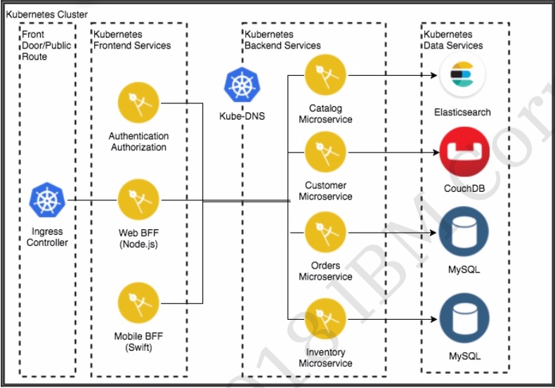

1. The BlueCompute application contains a frontend layer, a backend layer (microservices) and a data layer (backing services).

2. Let's go through this exercise to design how you will group and deploy the application. The deployment should start with the data layer, followed by the backend layer and the frontend layer.

3. For the following data services resource, which Kubernetes resources should you define?

	- ElasticSearch: _______________________________
	- CouchDB: _______________________________
	- Orders MySQL: _______________________________
	- Inventory MySQL: _______________________________

4. For the following backend services microservice applications, which Kubernetes resources should you define?

	- Catalog microservice: _______________________________
	- Customer microservice: _______________________________
	- Orders microservice: _______________________________
	- Inventory microservice: _______________________________

5. For the following frontend services application, which Kubernetes resources should you define? Assume for now that the Ingress resource will be deployed with the Web application and that you will ignore the swift Web BFF.

	- Authentication: _______________________________
	- Web BFF: _______________________________

6. Now that you have been through the design part, let's consider the following:

	- What resource(s) is/are common for all components?
<br>_______________________________
	- What resource(s) is/are common for the data layer?
<br>_______________________________
	- When would you have an ingress resource?
<br>_______________________________

## Exercise 2: Setting Up and Verifying Backing Services

The following instructions allow you to build and deploy the backend services required by the BlueCompute application.

**Note**: Better than just following these steps, you can learn much more by looking at the Jenkinsfile and helm charts you will be working with. This will help you understand what actually happens in the process.

1. Use a terminal session on the **Boot VM** to define a secret to access the IBM Cloud Private user:

	- Encode the user and password that is used to connect to ICP in base64:

		``echo admin | base64``

	- Create a ICP_secret.yaml file in your current directory with the following contents:

    ```
		apiVersion: v1
		kind: Secret
		metadata:
		  name: icpadmin
		type: Opaque
		data:
		  username: YWRtaW4K
		  password: YWRtaW4K
    ```

	- Load the secret to ICP

		``kubectl create -f ICP_secret.yaml -n jenkins``

2. Set up IBM Cloud Private registry parameters as a ConfigMap (namespace, imagePullSecret and registry).

	- Create a ICP_config.yaml file in your current directory with the following contents:

    ```
		apiVersion: v1
		kind: ConfigMap
		metadata:
		  name: icpconfig
		data:
		  namespace: default
		  registry: mycluster.icp:8500
    ```

	- Load the ConfigMap to ICP

		``kubectl create -f ICP_config.yaml -n jenkins``

3. In your browser, go to the Jenkins Web UI at `http://10.10.1.4/jenkins`. Log in as `admin` with a password of `admin_0000`. You should be in the Jenkins dashboard.

4. Click **New item** from the Jenkins menu on the left toolbar. <br>

5. Enter a name of `CouchDB`, select **Pipeline** and click **OK**.<br>

   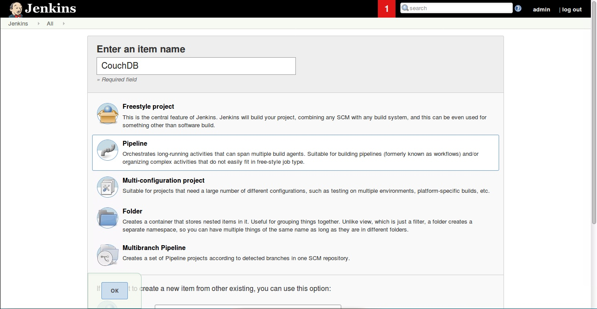

6. Scroll down to the Pipeline section and specify:

	- Definition: `Pipeline script from SCM`
	- SCM: `Git`
	- Repository URL: `https://github.com/davemulley/icp-jenkins-helm-bluecompute`
	- Branch Specifier: `*/master`
	- Script Path: `charts/ibmcase-couchdb/Jenkinsfile `
	- Click **Save**

	 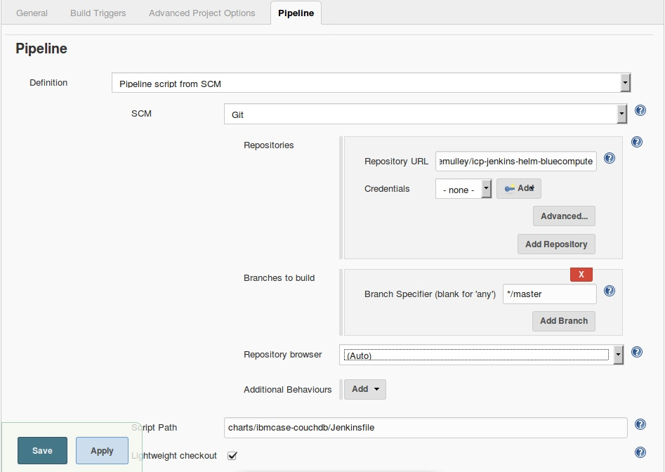

7. On the couchDB pipeline page, click **Build now**.<br>

8. Once the pipeline is running as indicated on the lower left side, open the drop down menu next to the run number and select **Console Output**. <br>

   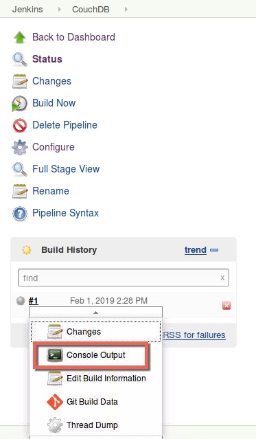

9. The console should show the helm chart being deployed at the end and the pipeline having finished successfully.<br>

   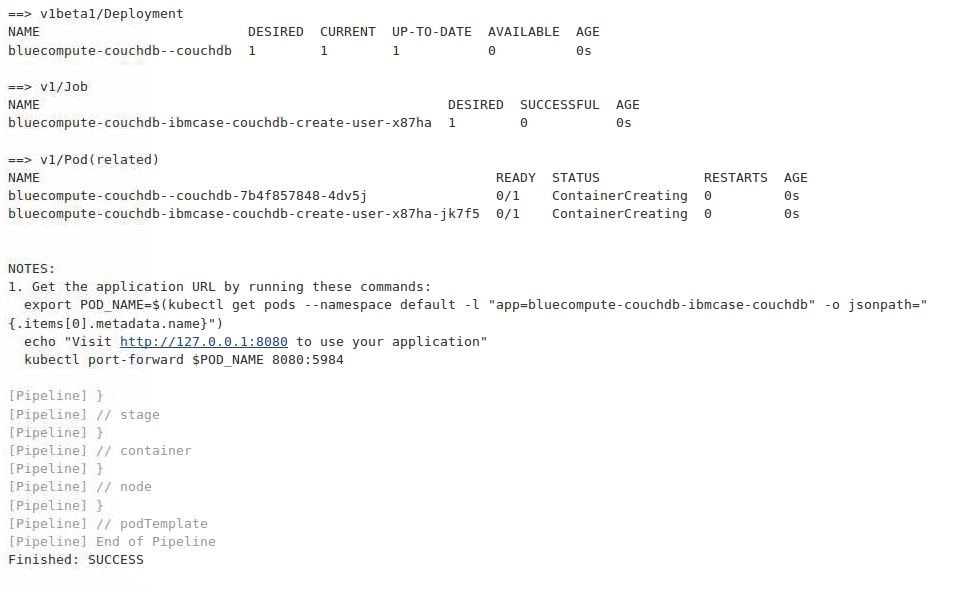

10. Having the helm chart deployed does not necessarily mean that the application is correctly deployed. You must check whether the actual application pod is running. This may take a couple of minutes depending on the network speed to load the container. Run `kubectl get pod` commands and wait until the pod for couchdb is running. <br>

   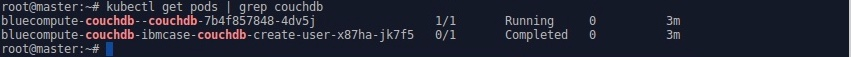

11. Check the status of the `bluecompute-couchdb` release, by running `helm status bluecompute-couchdb --tls`. <br>

   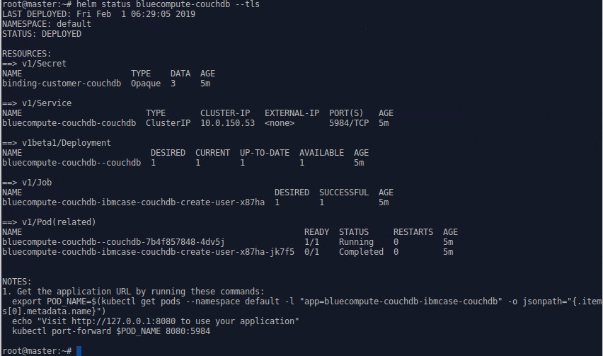<br>

	 Can you identify the chart's components?

	- Secret: `binding-customer-couchdb`
<br>___________________________________________
	- Service: `bluecompute-couchdb-couchdb`
<br>___________________________________________
	- Deployment: `bluecompute-couchdb--couchdb`
<br>___________________________________________
	- Job: `bluecompute-couchdb-ibmcase-couchdb-create-user-"*"  `
<br>___________________________________________
	- Pods: `bluecompute-couchdb--couchdb-"*" `and `bluecompute-couchdb-ibmcase-couchdb-create-user-"*" `
<br>___________________________________________

   **Note:** The deployment of the other backend components (elasticsearch, inventory-mysql and orders-mysql) is actually very similar. You create the Jenkins pipelines from SCM (GIT) and run them individually. These pipelines are not automated (triggered using code changes) as this is meant to be a stable backend. In a real production environment, you would want to add a PersistentVolumeClaim to physically host the data instead of storing it in volatile containers as this example describes.

12. Deploy `elasticsearch` by creating a new pipeline, with the following parameters:

	- Name: `Elasticsearch`
	- Repository URL: `https://github.com/davemulley/icp-jenkins-helm-bluecompute`
	- Branch Specifier: `*/master`
	- Script Path: `charts/ibmcase-elasticsearch/Jenkinsfile`

	- Run the pipeline using the **Build now** link.
	- Make sure the `bluecompute-elasticsearch` pod is running.

13. Check the status of the `bluecompute-elasticsearch` release, by running `helm status bluecompute-elasticsearch --tls`. <br>

    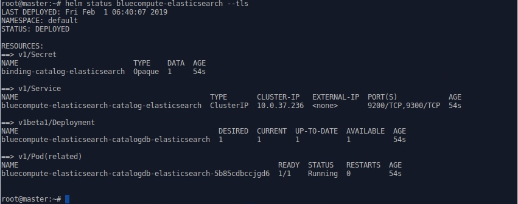<br>

	 Can you identify the chart's components?

	   - Secret: `binding-catalog-elasticsearch`
	<br>___________________________________________
	   - Service: `bluecompute-elasticsearch-catalog-elasticsearch`<br>___________________________________________
	   - Deployment: `bluecompute-elasticsearch-catalogdb-elasticsearch`<br>___________________________________________
	   - Pod: `bluecompute-elasticsearch-catalogdb-elasticsearch`-<br>___________________________________________

14. Deploy `inventory-mysql` by creating a new pipeline, with the following parameters:

	- Name: `Inventory-mysql`
	- Repository URL: `https://github.com/davemulley/icp-jenkins-helm-bluecompute `
	- Branch Specifier: `*/master`
	- Script Path: `charts/ibmcase-inventory-mysql/Jenkinsfile`

	- Run the pipeline using the **Build now** link.
	- Make sure the `bluecompute-inventory-mysql` pod is running

15. Check the status of the `bluecompute-inventory-mysql` release, by running `helm status bluecompute-inventory-mysql --tls`. <br>

    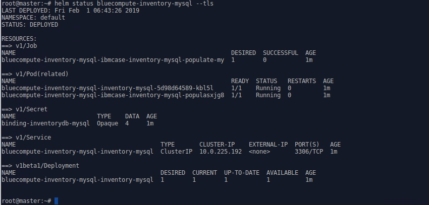<br>

	 Can you identify the chart's components?

	   - Secret: `binding-inventorydb-mysql`
<br>___________________________________________
	   - Service: `bluecompute-inventory-mysql-inventory-mysql`
<br>___________________________________________
	   - Deployment: `bluecompute-inventory-mysql-inventory-mysql`
<br>___________________________________________
	   - Job: `bluecompute-inventory-mysql-ibmcase-inventory-mysql-populate* `
<br>___________________________________________
	   - Pods: `bluecompute-inventory-mysql-inventory-mysql-* `and `bluecompute-inventory-mysql-ibmcase-inventory-mysql-popu* `
<br>___________________________________________

16. Deploy `orders-mysql` by creating a new pipeline, with the following parameters:

	- Name: `Orders-mysql`
	- Repository URL: `https://github.com/davemulley/icp-jenkins-helm-bluecompute `
	- Branch Specifier: `*/master`
	- Script Path: `charts/ibmcase-orders-mysql/Jenkinsfile`

	- Run the pipeline using the **Build now** link.
	- Make sure the `bluecompute-orders-mysql` pod is running

17. Check the status of the `bluecompute-orders-mysql` release, by running `helm status bluecompute-orders-mysql --tls`. <br>

    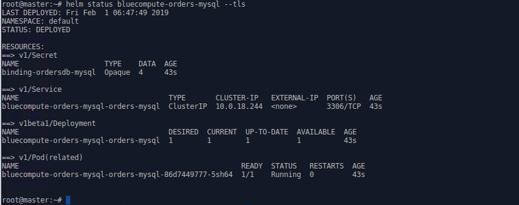<br>

	 Can you identify the chart's components?

	  - Secret: `binding-ordersdb-mysql`
<br>___________________________________________
	  - Service: `bluecompute-orders-mysql-orders-mysql`
<br>___________________________________________
	  - Deployment: `bluecompute-orders-mysql-orders-mysql`
<br>___________________________________________
	  - Pod: `bluecompute-orders-mysql-orders-mysql-* `
<br>___________________________________________

18. Answer the following questions:

	- How would you get the URL and credentials to access the backend services? <br>___________________________________________
	<br>___________________________________________

	- Why do some charts contain job(s) while other don't?
	<br>___________________________________________

	- What other resource is typically present for a backend service?
	<br>___________________________________________

## Exercise 3: Deploying Microservices Components

The set of charts in this exercise is different that in the previous set. The main difference is that the docker images are built by the pipeline and loaded to the IBM Cloud Private local registry.

**Note**:

These instructions load the Jenkinsfile directly from a forked repository that has been pre-configured. The actual steps should have been:

- Fork the repository.
- Create a Jenkinsfile.
- Poll the repository for commit changes and create a post-commit hook.

You would never need to build the pipeline manually.

1. There are 4 microservices built into the BlueCompute application: customer, inventory, catalog and orders. You will deploy them similar to deploying the backend resources, but using different source git repositories.

2. Create a new Jenkins pipeline using the following specifications for the `customer` application.

	- Name: `Customer`
	- Repository URL: `https://github.com/davemulley/refarch-cloudnative-micro-customer `
	- Branch Specifier: `*/master`
	- Script Path: `Jenkinsfile`

	- Run the pipeline using the **Build now** link.
	- Make sure the `customer` pod is running

11. Check the status of the `bluecompute-customer` release, by running `helm status bluecompute-customer --tls`. <br>

    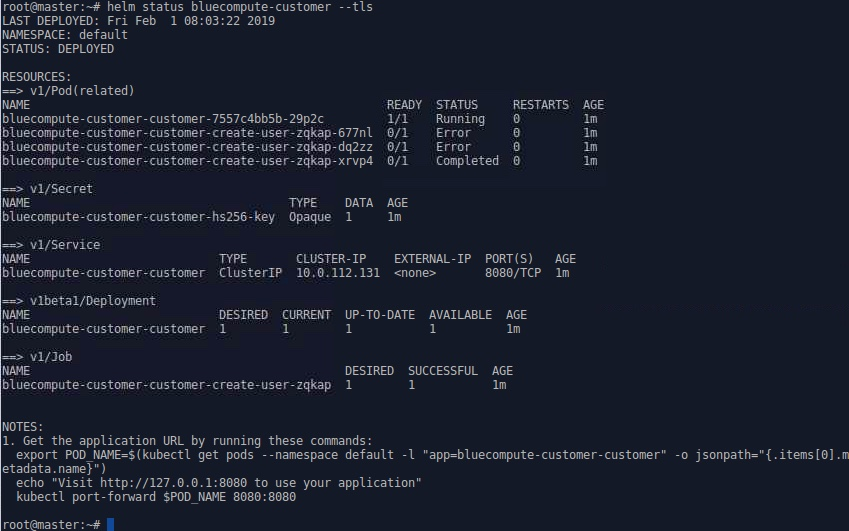

4. Test the `customer` application's health:

	- Open a terminal window
	- Run the command `kubectl port-forward <customerpod> 9080:8080` The command maps the pod 8080 to the localhost.
	- Open another terminal window and check the microservice. Note that most of the usual microservice REST calls for the `customer` application are protected by JWT. Therefore, you can only easily test the check call which returns the string `It works`.

			curl http://127.0.0.1:9080/micro/check

	- Stop the port forwarding by typing `Ctrl-C`.

	  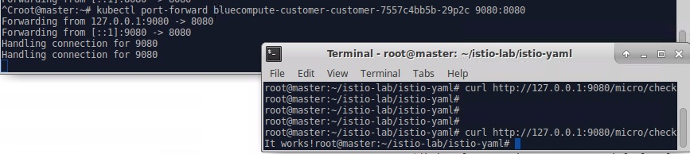

5. Create a new Jenkins pipeline using the following specifications for the `inventory` application.

	- Name: `Inventory`
	- Repository URL: `https://github.com/davemulley/refarch-cloudnative-micro-inventory `
	- Branch Specifier: `*/master`
	- Script Path: `inventory/Jenkinsfile`

	- Run the pipeline using the **Build now** link.
	- Make sure the `inventory` pod is running

6. Check the status of the `bluecompute-inventory` release, by running `helm status bluecompute-inventory --tls`. <br>

   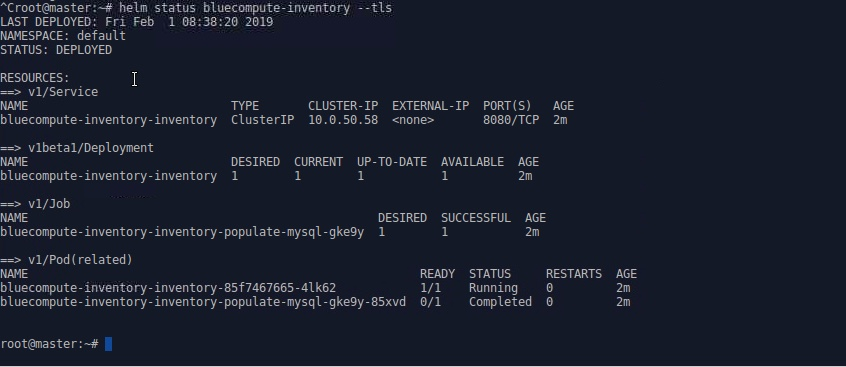

7. Test the `inventory` application's health:

	- Open a terminal window
	- Run the command `kubectl port-forward <inventorypod> 9080:8080` The command maps the pod 8080 to the localhost port 8080.
	- Open another terminal window and check the microservices. Note that this microservice is not secured (how do you know that? ___________________)

			curl http://127.0.0.1:9080/micro/inventory

	- Stop the port forwarding by typing `Ctrl-C`.

	  

8. Create a new Jenkins pipeline using the following specifications for the `catalog` application. Note that the repository below is correct. The `catalog` application is in the `inventory` repository.

	- Name: `Catalog`
	- Repository URL: `https://github.com/davemulley/refarch-cloudnative-micro-inventory`
	- Branch Specifier: `*/master`
	- Script Path: `catalog/Jenkinsfile`

	- Run the pipeline using the **Build now** link.
	- Make sure the `catalog` pod is running

9. Check the status of the `bluecompute-catalog` release, by running `helm status --tls bluecompute-catalog`. <br>

   

10. Test the `catalog` application's health:

	- Open a terminal window
	- Run the command `kubectl port-forward <catalogpod> 8081:8081` The command maps the pod 8081 to the localhost port 8081.
	- How do you know that this application uses port 8081? _______________________
	- Open another terminal window and check the microservice. Note that this microservice is not secured

			curl http://127.0.0.1:8081/micro/items/13401

	- Stop the port forwarding by typing `Ctrl-C`.

	  

11. Create a new Jenkins pipeline using the following specifications for the `orders` application.

	- Name: `Orders`
	- Repository URL: `https://github.com/ibm-cloud-academy/refarch-cloudnative-micro-orders `
	- Branch Specifier: `*/master`
	- Script Path: `Jenkinsfile`

	- Run the pipeline using the **Build now** link.
	- Make sure the `orders` pod is running

12. Check the status of the `bluecompute-orders` release, by running `helm status --tls bluecompute-orders`. <br>

    

13. Test the `orders` application's health:

	- Open a terminal window
	- Run the command `kubectl port-forward <orderspod> 8080:8080` The command maps the pod 8080 to the localhost port 8080.
	- Is this microservice being secured using JWT? ____

			curl http://127.0.0.1:8080/micro/check

	- Stop the port forwarding by typing `Ctrl-C`.

	  

14. Create a new Jenkins pipeline using the following specifications for the `authentication` application.

	- Name: `Auth`
	- Repository URL: `https://github.com/ibm-cloud-academy/refarch-cloudnative-auth `
	- Branch Specifier: `*/master`
	- Script Path: `Jenkinsfile`

	- Run the pipeline using the **Build now** link.
	- Make sure the `auth` pod is running

15. Check the status of the `bluecompute-auth` release, by running `helm status --tls bluecompute-auth`. <br>

    

16. You will test the oauth authentication later after the Web application has been deployed.


17. Create a new Jenkins pipeline using the following specifications for the `Web` application.

	- Name: `Web`
	- Repository URL: `https://github.com/ibm-cloud-academy/refarch-cloudnative-bluecompute-web `
	- Branch Specifier: `*/master`
	- Script Path: `Jenkinsfile`

	- Run the pipeline using the **Build now** link.
	- Make sure the `bluecompute-web` pod is running

15. Check the status of the `bluecompute-web` release, by running `helm status --tls bluecompute-web`. <br>

    

16. What resources are created in the Web application?
What are the usage of those resources?

	- ConfigMap:
	<br>___________________________________________
<br>___________________________________________

	- Ingress:
<br>___________________________________________
<br>___________________________________________

17. The final state of the Jenkins dashboard should be similar to the following:
<br>

    

## Exercise 4: Validating the Application and Resources

Now that you have completed all the deployments successfully, it's time to test the overall microservice application.

1. Open the URL to get to the BlueCompute web application: `http://proxy/bluecompute`
<br>

   

2. Click the `Log in` link and log in with as user `foo` and a password of `bar`.<br>

   

3. After login, the Catalog view is shown. This verifies that the `catalog` microservice is working.<br>

   

4. Select an item. The example below shows the Dayton Meat Chopper.<br>

   

5. From the **Place your order here** dropdown, select a number and click **Buy**. This checks whether the `Orders` microservice is working. You should be able to retrieve your orders in the **Profile** page.

6. Click the **Profile** link. Verify that it can retrieve your user profile and the orders you have placed.<br>

      


#### *** End of exercises ***
