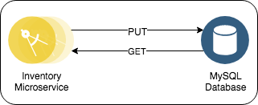
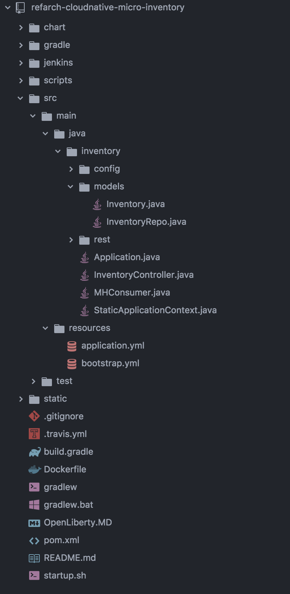
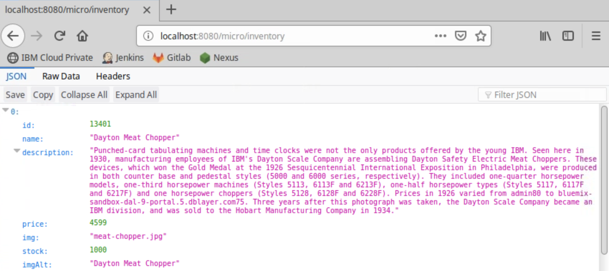
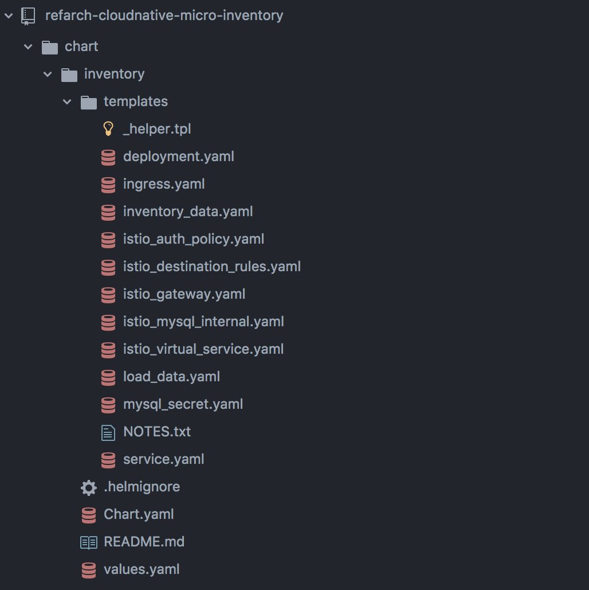
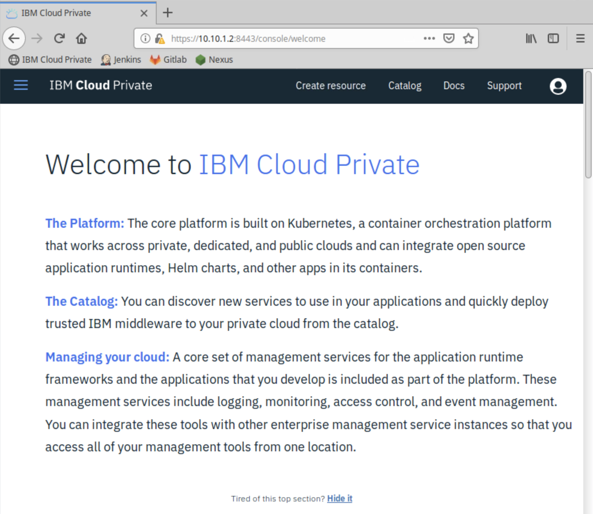
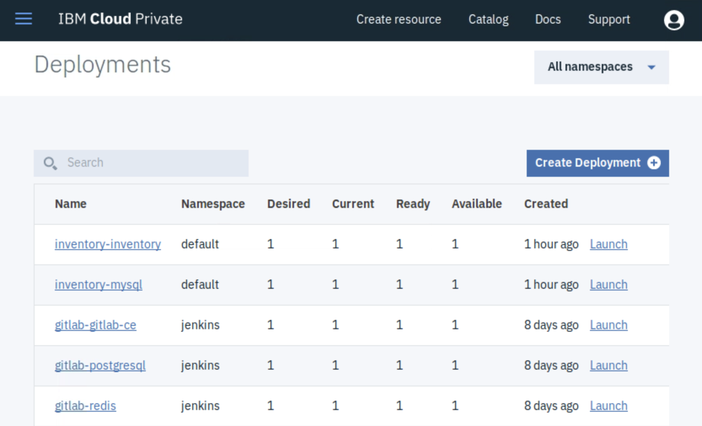
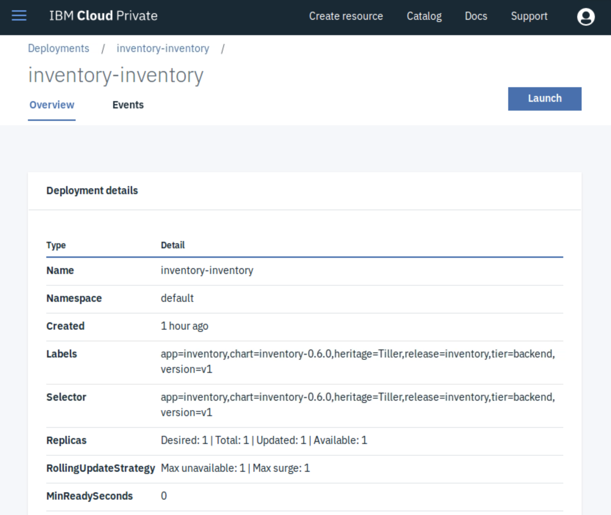
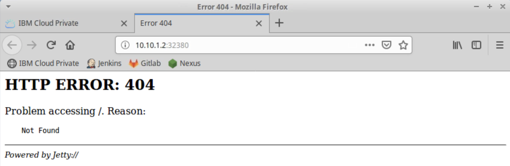
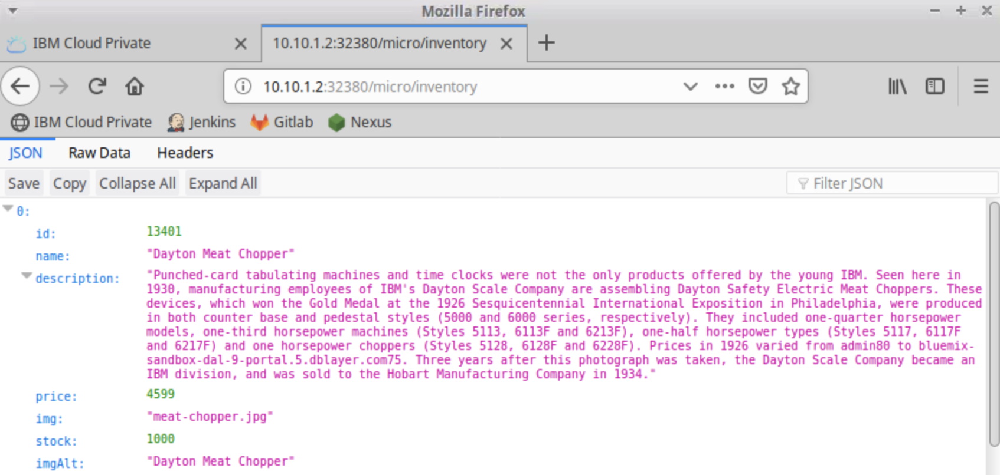

# Spring Boot Development on IBM Cloud Private

## Table of Contents
* [Setup](#setup)
* [Introduction](#introduction)
  + [What you will learn](#what-you-will-learn)
  + [How is Spring Boot supported on IBM Cloud Private?](#how-is-spring-boot-supported-on-ibm-cloud-private)
  + [Bluecompute - It's architecture](#bluecompute---its-architecture)
* [Inventory Spring Boot Service Overview](#inventory-spring-boot-service-overview)
  + [Inventory Architecture](#inventory-architecture)
  + [Project Structure](#project-structure)
  + [Build.gradle](#buildgradle)
  + [Spring Boot Source Code](#spring-boot-source-code)
    - [Application.java](#applicationjava)
  + [Create a Database Schema with an Entity Class](#create-a-database-schema-with-an-entity-class)
  + [Accessing and Transforming MySQL Data using Spring Data CrudRepository](#accessing-and-transforming-mysql-data-using-spring-data-crudrepository)
  + [Creating REST Endpoints to Serve MySQL Data with Spring RestController](#creating-rest-endpoints-to-serve-mysql-data-with-spring-restcontroller)
* [Run the Inventory Application Locally](#run-the-inventory-application-locally)
  + [Start the MySQL Database](#start-the-mysql-database)
  + [Populate MySQL Database with Inventory Data](#populate-mysql-database-with-inventory-data)
  + [Optional: View the Properties File](#optional-view-the-properties-file)
  + [Start the Inventory Application](#start-the-inventory-application)
  + [Cleanup](#cleanup)
* [Deploy the Inventory Application to IBM Cloud Private](#deploy-the-inventory-application-to-ibm-cloud-private)
  + [Login to IBM Cloud Private Using cloudctl CLI](#login-to-ibm-cloud-private-using-cloudctl-cli)
  + [Login to IBM Cloud Private Docker Registry](#login-to-ibm-cloud-private-docker-registry)
  + [Deploy the MySQL Helm Chart](#deploy-the-mysql-helm-chart)
  + [Build and Push the Inventory Docker Image to IBM Cloud Private Private Docker Registry](#build-and-push-the-inventory-docker-image-to-ibm-cloud-private-private-docker-registry)
  + [Optional: Inventory Dockerfile Overview](#optional-inventory-dockerfile-overview)
  + [Inventory Helm Chart Overview](#inventory-helm-chart-overview)
  + [Deploy Inventory Chart](#deploy-inventory-chart)
  + [Test the Inventory Deployment](#test-the-inventory-deployment)
* [Explore the Inventory Service on the IBM Cloud Private Web Console](#explore-the-inventory-service-on-the-ibm-cloud-private-web-console)
* [Cleanup](#cleanup-1)
* [Conclusion](#conclusion)

## Setup
Execute this lab on the `boot` node as the `root` user

In order to view the code in this project, you will need to clone it from GitLab:

```bash
# Create a new folder
cd /root
mkdir lab2
cd lab2

# Clone the inventory project (user: foo password: foobargitlab)
git clone http://gitlab-gitlab-ce/foo/refarch-cloudnative-micro-inventory.git

# Go to the project's root folder
cd refarch-cloudnative-micro-inventory

# Checkout the spring branch
git checkout spring
```

## Introduction
In this lab, you will learn about how to develop applications using Spring Boot on [IBM Cloud Private](https://www.ibm.com/cloud/private).

### What you will learn

You will learn how to get started with building a simple Spring Boot application which has some basic CRUD operations and deploy it to IBM Cloud Private.

### How is Spring Boot supported on IBM Cloud Private?

Spring is a very popular framework in Java which helps us to build Java based enterprise and web applications easily. This frameworks is most commonly used in the microservice architectures. To address the challenges of microservice based application, Spring Boot is introduced. Spring Boot easily enables us to quickly build production ready applications. It is very easy to deploy the application within containers using the embedded server (Apache Tomcat).

IBM Cloud Private Kubernetes based container platform supports frameworks like Spring, JEE etc. This platform helps you to develop and manage on-premise applications.

### Bluecompute - It's architecture
Before we get into the weeds of the Spring Project that we are going to build and deploy on ICP, let's zoom out a bit and take a look at the bigger picture. What kind of application can we build with simple Spring Microservices? Let's briefly look into the Microservices Reference Architecture Application, better known as BlueCompute, for which the Inventory microservice is one components.

**BlueCompute** is a simple store front shopping application that displays a catalog of antique computing devices, where users can search and buy products. It has a web interface that relies on separate BFF (Backend for Frontend) services to interact with the backend data. It provides a reference implementation for running a Cloud Native Web Application using a Microservices architecture on a Kubernetes cluster.


Let's break down the above architecture as follows:

* This OmniChannel application contains an [AngularJS](https://angularjs.org/) based web application. The diagram depicts it as Browser.
* The Web app invokes its own backend Microservices to fetch data, we call this component BFFs following the [Backend for Frontends](http://samnewman.io/patterns/architectural/bff/) pattern.  In this Layer, front end developers usually write backend logic for their front end.  The Web BFF is implemented using the Node.js Express Framework. These Microservices are packaged as Docker containers and managed by Kubernetes cluster.
* The BFFs invokes another layer of reusable Java Microservices. In a real world project, this is sometimes written by different teams.  The reusable microservices are written in Java. They run inside a Kubernetes cluster, for example the [IBM Cloud Kubernetes Service](https://www.ibm.com/cloud/container-service) or [IBM Cloud Private](https://www.ibm.com/cloud/private), using [Docker](https://www.docker.com/).
* The Java Microservices retrieve their data from the following databases:
  + The Catalog service retrieves items from a searchable JSON datasource using [ElasticSearch](https://www.elastic.co/).
  + The Customer service stores and retrieves Customer data from a searchable JSON datasource using [CouchDB](http://couchdb.apache.org/).
  + The Inventory Service uses an instance of [MySQL](https://www.mysql.com/).
  + The Orders Service uses an instance of [MariaDB](https://mariadb.org/).

Now that we understand **BlueCompute** on a high level, it will be a bit easier to understand how Spring, Kubernetes, and Helm can help you deploy such a complex application with ease.

Now, let's focus on breaking down the [Inventory Service](https://github.com/ibm-cloud-architecture/refarch-cloudnative-micro-inventory/tree/spring).

## Inventory Spring Boot Service Overview

### Inventory Architecture
The inventory microservice is a basic Spring Boot application that implements basic CRUD operations on a MySQL database. The MySQL database holds a complete list of names for the items in our store front.



### Project Structure
The project structure of our application looks like below. We are using Gradle as our build tool. Lets take a look at the contents of our project folder.



The main project folder is the `src` directory, which contains the Java source files. If you generate an empty project from the [Spring Initializer](https://start.spring.io/) web page, you will obtain the `build.gradle`, `gradle`, `gradlew`, `gradlew.bat`, `settings.gradle` and `src` files and folders, which our project has as well. Let's focus on those files/folders for now. We will come back to the rest of the project's files/folders later.

### Build.gradle
As mentioned earlier, the inventory service is built using Gradle, which is an open-source build automation system that can be used to download application dependencies (such as Spring Boot), compile the application, and even run automated tests.

Gradle needs a `build.gradle` file where you can define the application dependencies and the automation tasks. Let's look at what the project's `build.gradle` file looks like below:

```java
buildscript {
    repositories {
        mavenCentral()
    }
    dependencies {
        classpath("org.springframework.boot:spring-boot-gradle-plugin:1.3.2.RELEASE")
        classpath("io.spring.gradle:dependency-management-plugin:0.6.1.RELEASE")
    }
}

apply plugin: 'java'
apply plugin: 'eclipse'
apply plugin: 'idea'
apply plugin: 'spring-boot'
apply plugin: 'io.spring.dependency-management'

springBoot {
    mainClass = "inventory.Application"
}

jar {
    baseName = 'micro-inventory'
    version = '0.0.1'
}

repositories {
    mavenCentral()
}

sourceCompatibility = 1.8
targetCompatibility = 1.8

dependencyManagement {
    imports {
        mavenBom 'org.springframework.cloud:spring-cloud-netflix:1.0.4.RELEASE'
    }
}

dependencies {
    compile("org.springframework.boot:spring-boot-starter-web") {
        exclude module: "spring-boot-starter-tomcat"
    }
    compile("org.springframework.boot:spring-boot-starter-jetty")
    compile("org.springframework:spring-web")
    compile("org.springframework.boot:spring-boot-starter-actuator")
    compile("org.springframework.boot:spring-boot-starter-data-jpa")
    compile('org.springframework.boot:spring-boot-starter-jdbc')
    compile("org.springframework.boot:spring-boot-configuration-processor")
    compile("mysql:mysql-connector-java:5.1.28")
    compile("com.squareup.okhttp3:okhttp:3.5.0")
    compile("org.json:json:20160212")
    compile("org.yaml:snakeyaml:1.8")

    testCompile('junit:junit:[4,)')
}

test {
    useJUnit()
    testLogging {
        events 'started', 'passed'
        showStandardStreams = true
    }
}

task wrapper(type: Wrapper) {
    gradleVersion = '2.3'
}

```

When you look at the `build.gradle` file above, you see a few Spring Boot dependencies declared. Spring Boot was created to make the process of writing Spring applications (particularly REST applications) easier. Here is a breakdown of some of the Spring Boot dependencies:

- The `org.springframework.boot:spring-boot-starter-web` dependency configures the dependencies that are needed for a web application.
- The `org.springframework.boot:spring-boot-starter-data-jpa` dependency allows you to store data in the MySQL Database.
- The `org.springframework.boot:spring-boot-starter-jdbc` dependency allows you to access relational data using JDBC with Spring.
- The `org.springframework.boot:spring-boot-starter-actuator` dependency helps you monitor and manage your application. It also provides you with an endpoint `/health` to monitor the application's health, which we will go over in more detail later on.

We also use some other non-spring dependencies like `mysql:mysql-connector-java:5.1.28` to support JDBC drivers, `org.json:json:20160212` for JSON conversions logic, etc.

Let us now look at the `src` folder of our project.

### Spring Boot Source Code
In this section we will go over the contents of the `src` folder, which contains the Spring Boot Java files that implement the inventory application.

#### Application.java
If you expand **`src > main > java > inventory`**, you see **Application.java**, which is the project's main class:

```java
@SpringBootApplication
public class Application {

    public static void main(String[] args) {
        ApplicationContext ctx = SpringApplication.run(Application.class, args);
        System.out.println("Inventory microservice is ready for business...");
    }
}
```

The class is annotated with `@SpringBootApplication` which indicates that the application is built in Spring Boot. This annotation is equivalent to the following annotations with their default attributes:
* `@EnableAutoConfiguration`: enable Spring Boot’s auto-configuration mechanism
* `@ComponentScan`: enable @Component scan on the package where the application is located (see the best practices)
* `@Configuration`: allow to register extra beans in the context or import additional configuration classes

### Create a Database Schema with an Entity Class
In order to access and manipulate the field values from a row in the MySQL database programmatically, we need to create an `Entity` class. This Entity class will map the database objects to a schema that we can play with.

You can see the `Inventory` entity class under **`src > main > java > inventory > models > Inventory.java`**

```java
package inventory.models;

import javax.persistence.Entity;
import javax.persistence.GeneratedValue;
import javax.persistence.GenerationType;
import javax.persistence.Id;
import javax.persistence.Table;
import javax.validation.constraints.NotNull;

/**
 * Entity: inventorydb.items
 *
 */
@Entity
@Table(name = "items")
public class Inventory {

  // Use generated ID
  @Id
  @GeneratedValue(strategy = GenerationType.IDENTITY)
  private long id;

  // Item name
  @NotNull
  private String name;

  // Item description
  @NotNull
  private String description;

  // Item price
  @NotNull
  private int price;

  // Item img_alt
  private String img_alt;

  // Item img
  @NotNull
  private String img;

  // Item stock
  @NotNull
  private int stock;

  public Inventory() { }

  public Inventory(long id) {
    this.id = id;
  }

  public Inventory(String name, String description, int price, String img_alt, String img, int stock) {
    this.name = name;
    this.description = description;
    this.price = price;
    this.img = img;
    this.img_alt = img_alt;
    this.stock = stock;
  }

  public long getId() {
    return id;
  }

  public void setId(long value) {
    this.id = value;
  }

  public String getDescription() {
    return description;
  }

  public void setDescription(String value) {
    this.description = value;
  }

  public String getName() {
    return name;
  }

  public void setName(String value) {
    this.name = value;
  }

  public int getPrice() {
    return price;
  }

  public void setPrice(int value) {
    this.price = value;
  }

  public String getImg() {
    return img;
  }

  public void setImg(String img) {
    this.img = img;
  }

  public String getImgAlt() {
    return img_alt;
  }

  public void setImgAlt(String img_alt) {
    this.img_alt = img_alt;
  }

  public int getStock() {
    return stock;
  }

  public void setStock(int value) {
    this.stock = value;
  }

  public String toString() {
    StringBuilder string = new StringBuilder();
    string.append("{\n");
    string.append(String.format("\t\"id\": %s,\n", this.id));
    string.append(String.format("\t\"name\": \"%s\",\n", this.name));
    string.append(String.format("\t\"description\": \"%s\",\n", this.description));
    string.append(String.format("\t\"price\": %s,\n", this.price));
    string.append(String.format("\t\"imgAlt\": \"%s\",\n", this.img_alt));
    string.append(String.format("\t\"img\": \"%s\",\n", this.img));
    string.append(String.format("\t\"stock\": %s\n", this.stock));
    string.append("}");
    return string.toString();
  }
}
```

Having an entity class is a great start. But in order to use it, we will need a class that not only gets the objects from the database, but also transforms them into the entity object. For that, we are going to use a **Spring Data CrudRepository**.

### Accessing and Transforming MySQL Data using Spring Data CrudRepository
To access the database, all the CRUD functions such as insert, select, update and delete should be provided by a **Spring Data CrudRepository**. Spring Data which gives you most of the boilerplate code. In our application, our repository class will be an interface that extends `CrudRepository<Inventory, Long>` interface which is a part of Spring Data. This interface provides you with the basic CRUD operations and you can add additional methods based on your requirements.

You can access the repository class of our application under **`src > main > java > inventory > models > InventoryRepo.java`**.

```java
package inventory.models;

import java.util.List;
import javax.transaction.Transactional;

import org.springframework.data.repository.CrudRepository;
import org.springframework.stereotype.Repository;

/**
 * Inventory Repository
 *
 */

@Repository("inventoryRepo")
@Transactional
public interface InventoryRepo extends CrudRepository<Inventory, Long> {
  // find all by naming like /inventory/name/{name}
  List<Inventory> findByNameContaining(String name);

  // find all whose price is less than or equal to /inventory/price/{price}
  List<Inventory> findByPriceLessThanEqual(int price);
}
```

We are making progress! We can now access the MySQL data and use it programmatically with an Entity Class. In the next section, you will learn how to serve this data with via REST endpoints.

### Creating REST Endpoints to Serve MySQL Data with Spring RestController
If we want to serve this data back to the end user or another microservice, we will need to create a REST interface. For that we will need a **Spring RestController**.

Open the RestController class we created for the Inventory service at **`src > main > java > inventory > rest > InventoryController.java`**

```java
package inventory;

import inventory.models.Inventory;
import inventory.models.InventoryRepo;

import org.slf4j.Logger;
import org.slf4j.LoggerFactory;
import org.springframework.beans.factory.annotation.Autowired;
import org.springframework.beans.factory.annotation.Qualifier;
import org.springframework.web.bind.annotation.RestController;
import org.springframework.web.bind.annotation.RequestMapping;
import org.springframework.web.bind.annotation.RequestMethod;
import org.springframework.web.bind.annotation.ResponseBody;


/**
 * REST Controller to manage Inventory database
 *
 */
@RestController("inventoryController")
public class InventoryController {

  Logger logger =  LoggerFactory.getLogger(InventoryController.class);

  @Autowired
  @Qualifier("inventoryRepo")
  private InventoryRepo itemsRepo;

  /**
   * check
   */
  @RequestMapping("/check")
  @ResponseBody String check() {
    return "it works!";
  }

  /**
   * @return all items in inventory
   */
  @RequestMapping(value = "/inventory", method = RequestMethod.GET)
  @ResponseBody Iterable<Inventory> getInventory() {
    return itemsRepo.findAll();
  }
}
```

Let us stop by here a minute and see what our RestController does. This class is pretty simple to understand. It has two methods that exposes the endpoints `/check` and `/inventory` for HTTP GET requests.

The **check()** method is annotated with `@RequestMapping("/check")` and this method checks is the service is working by returning a simple string `it works!`.

The main method here is the **getInventory()** method, which is annotated with `@RequestMapping(value = "/inventory", method = RequestMethod.GET)` and this method gets the list of items from the database with the `CrudRepository` we created earlier and returns the array of `Entity` objects back user or the microservice that requested them. The `RestController` will take care of converting the Entity objects into the JSON data to the caller service.

## Run the Inventory Application Locally
In this section you will run the Inventory application locally. Before we show you how to do so, you will need to deploy a MySQL Docker container and populate it with the inventory data.

### Start the MySQL Database
The easiest way to get MySQL running is via a Docker container. In order to do so, run the following commands in your terminal.

```bash
# Log into IBM Cloud Private Private Docker Registry so that you can download the MySQL Image
docker login -u admin -p admin mycluster.icp:8500

# Export the database port, username, password, and database into environment variables
# We will be using these in the following commands
export MYSQL_ROOT_PASSWORD=admin123
export MYSQL_PORT=3306
export MYSQL_USER=dbuser
export MYSQL_PASSWORD=password
export MYSQL_DATABASE=inventorydb

# Start a MySQL Container with a database user, a password, and create a new database
docker run --name inventorymysql \
    -e MYSQL_ROOT_PASSWORD=${MYSQL_ROOT_PASSWORD} \
    -e MYSQL_USER=${MYSQL_USER} \
    -e MYSQL_PASSWORD=${MYSQL_PASSWORD} \
    -e MYSQL_DATABASE=${MYSQL_DATABASE} \
    -p ${MYSQL_PORT}:${MYSQL_PORT} \
    -d mycluster.icp:8500/default/ibmcase/mysql:5.7.14
```

### Populate MySQL Database with Inventory Data
In order for Inventory to make use of the MySQL database, the database needs to be populated first. Before doing so, let's take a look at the following SQL script:

```mysql
create database if not exists inventorydb;
use inventorydb;
create table if not exists items (
  id int not null auto_increment primary key,
  stock int not null,
  name varchar(100) not null,
  description varchar(1000) not null,
  price decimal(8,2) not null,
  img_alt varchar(75),
  img varchar(50) not null
);
insert ignore into items ( id, stock, price, img_alt, img, name, description ) values ( 13401, 1000, 4599.99, "Dayton Meat Chopper", "meat-chopper.jpg", "Dayton Meat Chopper", "Punched-card tabulating machines and time clocks were not the only products offered by the young IBM. Seen here in 1930, manufacturing employees of IBM's Dayton Scale Company are assembling Dayton Safety Electric Meat Choppers. These devices, which won the Gold Medal at the 1926 Sesquicentennial International Exposition in Philadelphia, were produced in both counter base and pedestal styles (5000 and 6000 series, respectively). They included one-quarter horsepower models, one-third horsepower machines (Styles 5113, 6113F and 6213F), one-half horsepower types (Styles 5117, 6117F and 6217F) and one horsepower choppers (Styles 5128, 6128F and 6228F). Prices in 1926 varied from admin80 to bluemix-sandbox-dal-9-portal.5.dblayer.com75. Three years after this photograph was taken, the Dayton Scale Company became an IBM division, and was sold to the Hobart Manufacturing Company in 1934." );
insert ignore into items ( id, stock, price, img_alt, img, name, description ) values ( 13402, 1000, 10599.99, "Hollerith Tabulator", "hollerith-tabulator.jpg", "Hollerith Tabulator", "This equipment is representative of the tabulating system invented and built for the U.S. Census Bureau by Herman Hollerith (1860-1929). After observing a train conductor punching railroad tickets to identify passengers, Hollerith conceived and developed the idea of using punched holes to record facts about people. These machines were first used in compiling the 1890 Census. Hollerith's patents were later acquired by the Computing-Tabulating-Recording Co. (which was renamed IBM in 1924) and this work became the basis of the IBM Punched Card System. Hollerith's tabulator used simple clock-like counting devices. When an electrical circuit was closed (through a punched hole in a predetermined position on the card), each counter was actuated by an electromagnet. The unit's pointer (clock hand) moved one step each time the magnet was energized. The circuits to the electromagnets were closed by means of a hand-operated press type card reader. The operator placed each card in the reader, pulled down the lever and removed the card after each punched hole was counted." );
insert ignore into items ( id, stock, price, img_alt, img, name, description ) values ( 13403, 1000, 699.99, "Computing Scale", "computing-scale.jpg",  "Computing Scale", "In 1885 Julius Pitrat of Gallipolis, Ohio, patented the first computing scale. Six years later, Edward Canby and Orange Ozias of Dayton, Ohio, purchased Pitrat's patents and incorporated The Computing Scale Company as the world's first computing scale vendor. And four years after that, The Computing Scale Company introduced the first automatic computing scale, shown here. In 1911, the Computing Scale Company merged with the International Time Recording Company and Tabulating Machine Company to form the Computing-Tabulating-Recording Company, a business that was renamed IBM in 1924." );
insert ignore into items ( id, stock, price, img_alt, img, name, description ) values ( 13404, 1000, 1299.99, "Tape Controlled Card Punch", "tape-controlled-punch.jpg", "Tape Controlled Card Punch", "IBM hired engineer-inventor Charles Doty in 1925, and he first worked as a secretary at the company’s main office at 50 Broad Street in Manhattan before transferring to the engineering laboratory at 225 Varick Street. Doty went on to write the specifications for a tape-to-card converter for engineers in IBM’s development laboratory in Endicott, N.Y. The first such machine consisted of a keypunch to which relays had been added to convert the code of the paper tape to the code of the punched cards, along with an attached paper-tape reading device. The engineering model was delivered and placed into testing on May 12, 1941, just three months after getting the green light for development. During the summer of 1941, the United States Army Air Corps received the first 10 units of the machine seen here, which was then known as the IBM 40 Tape Controlled Card Punch. Following delivery to the Air Corps, the Army’s Quartermaster Department, Signal Corps and other military organizations used the IBM 40, and its counterpart IBM 57 card-to-tape punch, for defense work during World War II. Commercial installations of both machines were also made at the New York, New Haven & Hartford Railroad; RCA; Bethlehem Steel; Vanity Fair; Western Electric; Merrill Lynch; Harris Upsham and others." );
insert ignore into items ( id, stock, price, img_alt, img, name, description ) values ( 13405, 1000, 3899.99, "IBM 77 Electric Punched Card Collator", "electric-card-punch.jpg", "Electric Card Collator", "The IBM 77 electric punched card collator performed many card filing and pulling operations. As a filing machine, the Type 77 fed and compared simultaneously two groups of punched cards: records already in file and records to be filed. These two groups were merged in correct numerical or alphabetical sequence. When operated for the purpose of pulling cards, the Type 77 made it possible for one group of cards to pull corresponding cards from another group. Introduced in 1937, the IBM 77 collator rented for 0 a month. It was capable of handling 240 cards a minute, and was 40.5 inches long and 51 inches high. IBM withdrew the Type 77 from marketing on November 27, 1957." );
insert ignore into items ( id, stock, price, img_alt, img, name, description ) values ( 13406, 1000, 2799.99, "Collator", "collator.jpg", "Collator", "The 85 collator performed many card filing and selection operations. It simultaneously could feed two sets of cards, merging the matched cards and selecting unmatched cards. In addition, the machine could check the sequence of the primary file of cards. It fed up to 120 cards per minute in each feed. IBM withdrew the 85 collator from marketing on September 7, 1978." );
insert ignore into items ( id, stock, price, img_alt, img, name, description ) values ( 13407, 1000, 1899.99, "Summary Punch", "summary-punch.jpg", "Gang Summary Punch", "The IBM 523 gang summary punch made its debut on February 17, 1949. When attached to an IBM 400-series accounting machine, the 523 punched summary cards for various totals at the rate of 100 cards a minute. Gang punching and summary punching operations could be performed simultaneously. The last model of the 523 was withdrawn from marketing on December 1, 1975." );
insert ignore into items ( id, stock, price, img_alt, img, name, description ) values ( 13408, 1000, 5199.99, "608 Calculator", "608-calculator.jpg", "Calculator", "The IBM 608 calculator (shown at left) was the first completely transistorized computer available for commercial installation. Announced in April 1955, the 608 began the transition of IBM's line of small and intermediate electronic calculators from vacuum tube to transistor operation. It contained more than 3,000 transistors -- tiny germanium devices no bigger than a paper clip -- and magnetic cores -- doughnut-shaped objects slightly larger than a pinhead, in the first known use of transistors and cores together in a computer. The magnetic cores could remember information indefinitely and recall it in a few millionths of a second, and made up the machine's internal storage or memory.<br>The 608's transistors made possible a 50 percent reduction in physical size and a 90 percent reduction in power requirements over comparable vacuum tube models. The machine could perform 4,500 additions a second, a computing speed 2.5 times faster than IBM's Type 607 calculator introduced only two years before. It could multiply two 9-digit numbers and derive the 18-digit product in 11 one-thousandths of a second, and divide an 18-digit number by a nine-digit number to produce the nine-digit quotient in just 13 one-thousandths of a second. The associated IBM 535 card read punch (shown at right) was used for both input and output, and was designed to permit a card to be calculated and the results punched while passing through the machine at the rate of 155 cards per minute.<br>In 1957, customers could purchase the 608 for 3,210 (or rent it for admin,760 a month) and the 535 for 228044,838 (or rent it for 15 a month). The 608 was withdrawn from marketing in April 1959." );
insert ignore into items ( id, stock, price, img_alt, img, name, description ) values ( 13409, 1000, 399.99, "803 Proof Machine", "803-proof.jpg", "Proof Machine", "Debuting in July 1949, the IBM 803 Proof Machine was used to sort, list, prove and endorse checks, sales tickets, vouchers and other business documents in a single operation. Containing 32 sorting receptacles, the 803 had a number of compartment adding tapes. A control tape recorded all transactions in the original sequence, with sub and final totals of distributions. The ten-key electrified adding machine keyboard simplified the 803's operation. The machine also had signal lights to indicate the near depletion of the tape supply and other operating conditions. The 803 Proof Machine was withdrawn in December 1981 after more 30 years in the product catalogue." );
insert ignore into items ( id, stock, price, img_alt, img, name, description ) values ( 13410, 1000, 899.99, "Model 01 Electric Typewriter", "01-typewriter.jpg", "Model 01 Typewriter", "In 1933 IBM acquired the tools, patents and production facilities of Electromatic Typewriters, Inc., of Rochester, N.Y. In the year following the acquisition, IBM invested more than admin million to redesign the Electromatic Typewriter, improve the company's research facilities and establish service centers. In 1935, the Model 01 IBM Electric Typewriter, seen here, was introduced. Wide customer acceptance soon made it the first successful electric typewriter in the United States." );
insert ignore into items ( id, stock, price, img_alt, img, name, description ) values ( 13411, 1000, 1199.99, "Model A Standard Electric Typewriter", "a-typewriter.jpg", "Model A Typewriter", "In 1948 IBM introduced the IBM Model A Standard Electric Typewriter. This machine gave typists a new feeling of comfort and control as the carriage return, back space, tabulator and shift were operated with a fingertip touch. The Model A's multiple-copy control ensured legible carbon copies and stencils." );
insert ignore into items ( id, stock, price, img_alt, img, name, description ) values ( 13412, 1000, 2199.99, "Selectric Typewriter", "selectric.jpg", "Selectric Typewriter", "Unveiled in 1961, the revolutionary Selectric typewriter eliminated the need for conventional type bars and movable carriages by using an innovative typing element on a head-and-rocker assembly, which, in turn, was mounted on a small carrier to move from left to right while typing." );
```

The above may look like a lot but it's pretty simple. Here is what it does:
* It creates the `inventorydb` database if it doesn't already exist.
* Then it creates the `items` table and its data schema if it doesn't already exist.
* Finally, it inserts each item record one by one.

Now that you know what the data looks like, lets go ahead and load it into the MySQL container by running the following command:

```bash
until mysql -h 127.0.0.1 -P ${MYSQL_PORT} -u${MYSQL_USER} -p${MYSQL_PASSWORD} <./scripts/mysql_data.sql; do echo "waiting for mysql"; sleep 1; done; echo "Loaded data into database"
```

If you get the `Loaded data into database` message in your terminal, that means your database is loaded and ready to use!

### Optional: View the Properties File
For the inventory application, the configurations are all stored in the `application.yml` file. This file will pick up the environment variables first instead of the defaults.

This file can be accessed at **`src > main > resources > application.yml`**

```yaml
eureka:
  client:
    enabled: false
    registerWithEureka: false
  fetchRegistry: false

# Server configuration
server:
  context-path: /micro
  port: ${SERVICE_PORT:8080}

management:
  port: ${MANAGEMENT_PORT:8090}

# Spring properties
spring:
  application:
    name: inventory

  # MySQL Data source configuration
  datasource:
    driverClassName: com.mysql.jdbc.Driver
    url: jdbc:mysql://${MYSQL_HOST:127.0.0.1}:${MYSQL_PORT:3306}/${MYSQL_DATABASE:inventorydb}
    username: ${MYSQL_USER:root}
    password: ${MYSQL_PASSWORD:}
    port: ${MYSQL_PORT:3306}
    max-active: 4
    testOnBorrow: true
    validationQuery: SELECT 1

  jpa:
    database: MYSQL
    show-sql: true
    hibernate:
      ddl-auto: update
      naming-strategy: org.hibernate.cfg.ImprovedNamingStrategy
```

We prefer using environment variables to avoid recompiling the code when making a configuration change.

### Start the Inventory Application
Once MySQL is ready and populated, we can run the Spring Boot Inventory application locally as follows:

```bash
# 1. Build the application:
gradle build

# 2. Run the application on localhost:
java -jar build/libs/micro-inventory-0.0.1.jar
```

To validate that everything works successfully, you can open a browser tab and enter `http://localhost:8080/micro/inventory` as the URL and you should get a list of all the inventory items.



That's it, you have successfully started and tested the Inventory application!

### Cleanup
To stop the Inventory application, you just have to press `CTRL+c` on the terminal window.

To stop the MySQL docker container, run the following commands on your terminal:
```bash
# Kill the MySQL container
docker kill inventorymysql

# Release the container name so that it can be used again in the future
docker rm inventorymysql
```

Now that you learned about Spring Boot services and how to start them, let's take it up a notch and deploy this service in an IBM Cloud Private cluster.

## Deploy the Inventory Application to IBM Cloud Private
In this section, you will deploy the Inventory microservice on an IBM Cloud Private Cluster.

### Login to IBM Cloud Private Using cloudctl CLI
In order to use `kubectl` and `helm` commands to deploy the Inventory service, we will need to download the ICP cluster certificates using the `cloudctl` CLI. To do so, run the following commands in your terminal:
```bash
# Initialize the helm client.
helm init --client-only

# Login as the admin user into the default namespace using cloudctl
cloudctl login -a https://10.10.1.2:8443 -u admin -p admin -n default --skip-ssl-validation

# Check helm to tiller connectivity.
helm version --tls
```

If the last command gives you an output similar to the following, that means that `kubectl` and `helm` CLIs are now correctly configured.
```bash
Client: &version.Version{SemVer:"v2.9.1", GitCommit:"20adb27c7c5868466912eebdf6664e7390ebe710", GitTreeState:"clean"}
Server: &version.Version{SemVer:"v2.9.1+icp", GitCommit:"420a6e6c4e8420efba6ea5c2eba846bdc9a086c1", GitTreeState:"clean"}
```

Now, you should be able to use **kubectl** and **helm** to deploy your applications to IBM Cloud Private.

### Login to IBM Cloud Private Docker Registry
If you haven't done so already, login to the ICP Private Docker Registry::
```bash
# Login to the ICP Docker Registry
docker login -u admin -p admin mycluster.icp:8500
```

### Deploy the MySQL Helm Chart
Before we deploy the Inventory application, we need to deploy the MySQL database into ICP itself.

We can deploy the MySQL using the community Helm Chart for MySQL [here](https://github.com/helm/charts/tree/master/stable/mysql)

```bash
# Install MySQL Chart
helm upgrade --install mysql --namespace default \
  --version 0.10.2 \
  --set image="mycluster.icp:8500/default/ibmcase/mysql" \
  --set imageTag="5.7.14" \
  --set fullnameOverride="inventory-mysql" \
  --set mysqlRootPassword=${MYSQL_ROOT_PASSWORD} \
  --set mysqlUser=${MYSQL_USER} \
  --set mysqlPassword=${MYSQL_PASSWORD} \
  --set mysqlDatabase=${MYSQL_DATABASE} \
  --set persistence.enabled=false \
  stable/mysql --tls
```

Notice that we changed the `image` field to pull the `MySQL` image from ICP Docker Registry in order to minimize network consumption on Skytap.

Assuming you get no errors, you are done installing MySQL on ICP! Also notice that we did not populate the MySQL database as this step will be completed by the Inventory Helm Chart later on.

**NOTE:** You should have learned about the basics of Kubernetes and Helm Charts on the Bootcamp Pre-requirements. If you are still unclear about Helm Charts, you can read about them here on Helm's public documentation on GitHub:
* https://github.com/helm/helm/blob/master/docs/charts.md

### Build and Push the Inventory Docker Image to IBM Cloud Private Private Docker Registry
In order to deploy an Inventory container to ICP, we will need to build a Docker Image from the Inventory code and push it to ICP's Private Docker Registry. To do so, run the following command from your terminal in the project's root folder:
```bash
# 1. Build the image.
docker build -t mycluster.icp:8500/default/inventory:test .

# 2. Push your image to registry.
docker push mycluster.icp:8500/default/inventory:test
```

Now we are ready to deploy the Inventory Helm Chart! Before we do so, let's get a quick overview of the contents of the Inventory Helm Chart.

### Optional: Inventory Dockerfile Overview
If you are curious about the Dockerfile used to build the Inventory Docker Image, let's look at it together. It's quite interesting:

```Dockerfile
# STAGE: Build
FROM gradle:4.9.0-jdk8-alpine as builder

# Create Working Directory
ENV BUILD_DIR=/home/gradle/app/
RUN mkdir $BUILD_DIR
WORKDIR $BUILD_DIR

# Download Dependencies
COPY build.gradle $BUILD_DIR
RUN gradle build -x :bootRepackage -x test --continue

# Copy Code Over and Build jar
COPY src src
RUN gradle build -x test

# STAGE: Deploy
FROM openjdk:8-jre-alpine

# Install Extra Packages
RUN apk --no-cache update \
 && apk add jq bash bc ca-certificates curl \
 && update-ca-certificates

# Create app directory
ENV APP_HOME=/
RUN mkdir $APP_HOME
WORKDIR $APP_HOME

# Copy jar file over from builder stage
COPY --from=builder /home/gradle/app/build/libs/micro-inventory-0.0.1.jar $APP_HOME
RUN mv ./micro-inventory-0.0.1.jar app.jar

COPY startup.sh startup.sh
COPY scripts scripts

EXPOSE 8080 8090
ENTRYPOINT ["./startup.sh"]
```

I am sure you already know the basics of Docker images so I am not going to explain those. The main thing I want to point out is that this Dockerfile leverages [`multi-stage builds`](https://docs.docker.com/develop/develop-images/multistage-build/), which lets you create multiple stages in your Dockerfile to do certain  tasks. In our case, we have 2 stages. The first one uses `gradle:4.9.0-jdk8-alpine` as its base image to download and build the project and its dependencies using Gradle. The second stage uses `openjdk:8-jre-alpine` as its base image to run the compiled code from the previous stage.

The advantage of using the `multi-stage builds` approach is that the resulting image only uses the base image of the last stage. Meaning that in our case, we will only end up with the `openjdk:8-jre-alpine` as our base image, which is much tinier than having an image that has both Gradle and the JRE.

By using the `multi-stage builds` approach when it makes sense to use it, you will end up with much lighter and easier to maintain images, which can save you space on your Docker Registry. Also, having tinier images usually means less resource consumption on your worker nodes, which can result cost-savings.


### Inventory Helm Chart Overview
Lets take a look at our Inventory helm chart. Here is a look at the chart folder structure located at `chart/inventory`:



Lets us walk you down through some of the important files here. Ignore the `ingress.yaml` and all the `istio_*` prefixed files as they don't pertain to this lab.

***chart.yaml***

This YAML file gives you basic Inventory Chart metadata. You will get to know the details of the chart like name, version, etc.

```yaml
apiVersion: v1
description: BlueCompute Inventory Microservice
name: inventory
version: 0.6.0
```

***values.yaml***

This YAML file contains of all the chart's configurable values, which are passed to the templates later on. Notice that we can configure thinks like the Docker Image repository and tag and even things such as what port to expose to other Kubernetes services.

```yaml
replicaCount: 1

image:
  repository: ibmcase/bluecompute-inventory
  tag: 0.6.0
  pullPolicy: Always

service:
  type: ClusterIP
  externalPort: 8080
  internalPort: 8080
  managementPort: 8090
  nodePort: 32380

...

mysql:
  host: inventory-mysql
  port: 3306
  existingSecret:
  user: dbuser
  password: password
  database: inventorydb
  # For mysql init container
  image: "mysql"
  imageTag: "5.7.14"
  imagePullPolicy: IfNotPresent
  istio:
    mTLS: ISTIO_MUTUAL
    loadBalancer: LEAST_CONN

resources:
  limits:
    memory: 384Mi
  requests:
    memory: 64Mi

labels:
  app: inventory
  version: v1
  tier: backend

...
```

***deployment.yaml***

The deployment YAML file is perhaps the most important Kubernetes resources. It is where you define the containers that will run your application on ICP or any Kubernetes platform. In a deployment we can define things like the container's image, environment variables, init containers (we use them here to make sure that MySQL is up and running before starting the container), application resources (CPU and RAM). Remember the `spring-boot-starter-actuator` Gradle dependency we talked about earlier? We can use the `/health` endpoint provided by it on the management port to check on the application's health via `readinessProbe` and `livenessProbe`.

```yaml
apiVersion: extensions/v1beta1
kind: Deployment
metadata:
  name: {{ template "inventory.fullname" . }}
  labels:
    {{- include "inventory.labels" . | indent 4 }}
spec:
  replicas: {{ .Values.replicaCount }}
  template:
    metadata:
      labels:
        {{- include "inventory.labels" . | indent 8 }}
    spec:
      initContainers:
      {{- include "inventory.mysql.initcontainer" . | indent 6 }}
      containers:
      - name: {{ .Chart.Name | quote }}
        image: "{{ .Values.image.repository }}:{{ .Values.image.tag }}"
        imagePullPolicy: "{{ .Values.image.pullPolicy }}"
        ports:
        - containerPort: {{ .Values.service.internalPort }}
          protocol: TCP
        readinessProbe:
          httpGet:
            path: /health
            port: {{ .Values.service.managementPort }}
          initialDelaySeconds: 20
          periodSeconds: 10
          failureThreshold: 6
        livenessProbe:
          httpGet:
            path: /health
            port: {{ .Values.service.managementPort }}
          initialDelaySeconds: 35
          periodSeconds: 20
          failureThreshold: 6
        env:
        {{- include "inventory.environmentvariables" . | indent 8 }}
        {{- include "inventory.mysql.environmentvariables" . | indent 8 }}
        resources:
{{ toYaml .Values.resources | indent 10 }}
```

***service.yaml***
Having a deployment is cool and all. But how do we expose this deployment to the world or at least to other containers running on ICP? We do this with a `Service` YAML file.

This YAML file creates a service for your application on Kubernetes. What that means is that it enables service discovery for this applications so that other apps can access it with the specified service name (via kube-dns or core-dns) and service port. Having a service name also provides simple laod balancing capabilities if you have multiple replicas of the same container.

```yaml
apiVersion: v1
kind: Service
metadata:
  name: {{ template "inventory.fullname" . }}
  namespace: {{ .Release.Namespace }}
  labels:
    {{- include "inventory.labels" . | indent 4 }}
spec:
  type: {{ .Values.service.type }}
  ports:
  - name: http
    protocol: TCP
    port: {{ .Values.service.externalPort }}
    targetPort: {{ .Values.service.internalPort }}
{{- if and (eq .Values.service.type "NodePort") .Values.service.nodePort }}
    nodePort: {{ .Values.service.nodePort }}
{{- end }}
  selector:
    {{- include "inventory.labels" . | indent 4 }}
```

Let's move on to the MySQL Secret.

***mysql_secret.yaml***

Since the Inventory service needs to communicate to a MySQL instance, it needs to be aware of its username and password. However, you don't want to pass in the MySQL credentials in plain text. What if someone compromises the ICP cluster? They will be able to see the credentials in plain text! A secure way to store credentials in Kubernetes is via Kubernetes `Secret`s.

A secret file can store sensitive data such as keys, credentials, passwords etc. In our application, we are using this file to store the MySQL password, which then gets mounted on the Inventory deployment as an environment variable.

```yaml
{{- if and (not .Values.mysql.existingSecret) .Values.mysql.password }}
apiVersion: v1
kind: Secret
metadata:
  name: {{ template "inventory.fullname" . }}-mysql-secret
  labels:
    {{- include "inventory.labels" . | indent 4 }}
type: Opaque
data:
  mysql-password: {{ .Values.mysql.password | b64enc | quote }}
{{- end }}
```

With the above you explanation you get an idea of what Inventory Helm chart looks like and how it deploys the Inventory microservice. As an exercise for the reader, open the `inventory-data.yaml` and `load-data.yaml` files to learn how this chart uses a `ConfigMap` and a `Job` to save the inventory data into Kubernetes and then load it to the MySQL deployment.

### Deploy Inventory Chart
We are almost done with this section. Now that we understand the Inventory Helm chart, let's use it to deploy the Inventory service on ICP. To do so, run the following commands

```bash
# Deploy Inventory to Kubernetes cluster
helm upgrade --install inventory --namespace=default \
  --set image.repository=mycluster.icp:8500/default/inventory\
  --set image.tag=test \
  --set service.type=NodePort \
  --set service.nodePort=32380 \
  --set mysql.existingSecret=inventory-mysql \
  chart/inventory --tls
```

If it all went well, you will get some text with instructions on how to access the inventory service via it's NodePort.

### Test the Inventory Deployment
Before we can test the inventory service, we need to check that the deployment started successfully. The first option is to use the following command, which polls for all the status updates in the inventory deployments until it has been successfully started:
```bash
kubectl rollout status deployment/inventory-inventory
```

If you get the following output, then it means that it all went well:
```bash
deployment "inventory-inventory" successfully rolled out
```

Another option is to simply check the status of the pods directly. To do so, you can run the following command:
```bash
kubectl get pods
```

If you get an output similar to the following, then that means that it everything is running smoothly:
```bash
NAME                                             READY     STATUS      RESTARTS   AGE
inventory-inventory-676c99795b-l95k6             1/1       Running     0          6m
inventory-inventory-populate-mysql-uaeai-wmfhv   0/1       Completed   0          6m
inventory-mysql-7f8df9f884-25n9l                 1/1       Running     0          7m
```

Where:
* `inventory-inventory-*` is the inventory service pod, which is running successfully.
* `inventory-inventory-populate-mysql-*` is the pod that was created by a `Job` to populate MySQL with the inventory data, which, as we can see, it `Completed` successfully and is no longer running.
* `inventory-mysql-*` is the pod that runs the MySQL database.

To validate that everything works successfully, you can open a browser tab and enter `http://10.10.1.4:32380/micro/inventory` as the URL and you should get a list of all the inventory items.


That's it, you have successfully started and tested the Inventory application on IBM Cloud Private!

## Explore the Inventory Service on the IBM Cloud Private Web Console
We were able to deploy the Inventory Application on IBM Cloud Private using the `cloudctl` and `helm` CLIs, which work great for automated tasks and CI/CD. But what if you want to visually examine your deployments through a UI and even make changes to them? For that we have the ICP web console!

In this section we are not going to deploy anything but you will learn how to use the ICP web console to access deployed services. To start, open the a browser tab and click on the `IBM Cloud Private` bookmark, or simply double-click the IBM Cloud Private shortcut on the Desktop. If you are asked to login, use `admin` for both the username and password, which is not something we recommend in a production ICP cluster BTW! If successful, you will see a view similar to the following:



Let's go to the `Deployments` view by clicking on `Top left Hamburger Button -> Workloads -> Deployments`. If done correctly, you will see a view similar to the following:



You should be able to see the `inventory-inventory` and `inventory-mysql` deployments with `1`s under the **Available** column, which means that their pods are up and running successfully.

Click on the `inventory-inventory` deployment to view more details about it. If done correctly, you will see a view similar to the following:



Feel free to look around. In here you will see details of the deployment itself (which we set via the deployment YAML file mentioned earlier) and the pods and services connected to it.

You can click the blue `Launch` button at the top to launch a new browser tab that will access the inventory service itself. If successful, you will see a view similar to the following:



Don't get discouraged! You are seeing the above message because, when clicking the `Launch` button, the ICP Console just opens a URL for the service using the `32380` NodePort and the root `/` path, which is not supported in the Inventory service. To see the inventory data, all you have to do is add the `/micro/inventory` path to the URL and you will be good to go. If done correctly, it will look similar to the following image:



Congratulations! You have successfully deployed and tested the Inventory Helm Chart on ICP programmatically and through the ICP web console!

## Cleanup
To uninstall the Inventory and MySQL charts, run the following commands in your terminal:
```bash
helm delete inventory --purge --tls
helm delete mysql --purge --tls
```

## Conclusion
You have successfully completed this lab! Let's take a look at what you learned and did today:

* Learned about Spring Boot features and how easy it is to create CRUD services and REST services with very little code.
* Learned about Gradle and how to use it to declare dependencies and run automation tasks to compile the Java code.
* Deployed a MySQL container and loaded it with inventory data.
* Ran the Inventory service locally and connected it to the MySQL container.
* Ran some manual tests to verify that the inventory service worked correctly.
* Learned about Helm chart structure and the different components in the Inventory Helm Chart.
* Deployed both the MySQL community on ICP.
* Built and pushed the Inventory Docker image to ICP's private Docker Registry.
* Deployed the Inventory Helm chart using the newly created Inventory Docker Image.
* Ran some manual tests to verify that Inventory deployment was running correctly.
* Used the ICP web console to explore and launch the Inventory service.

That was quite a lot you did there today, so Congratulations!
